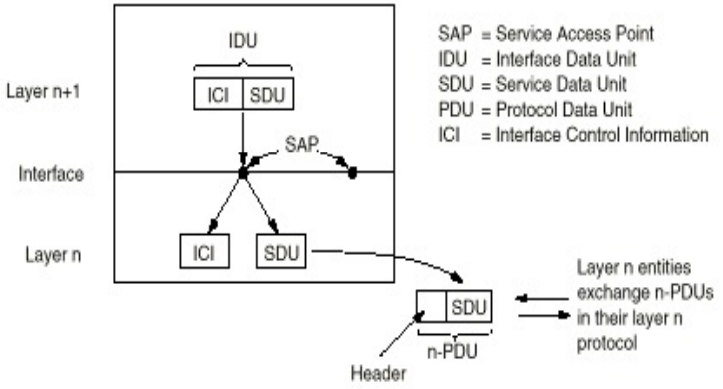

# 计算机网络原理

# 计算机网络的历史和新进展

## 计算机网络概述

- 网络提供的最基本服务：信息传递
- 不同的网络用所提供的服务区分
- 网络类型
    - 空间距离：局域网、城域网、广域网、个域网
    - 信息类型：数据网络、电话网络
    - 应用类型：专用网络、通用网络
    - 使用权：私有、公用
    - 协议的所有权：私有、开放

## 互联网的发展和成功经验

- 互联网
    - 全球范围、通用、异构的公用计算机网络
    - 开放的标准：IETF
    - 是其他类型网络的技术基础
- 三大定律
    - 摩尔定律：CPU性能18个月翻番
    - 光纤定律：骨干网带宽9个月翻番
    - 麦特卡菲定律：网络价值随用户数平方成正比
- 互联网标准化组织：IETF、IRTF、IAB、IESG

## 互联网的核心思想：分组交换

- IP
    - 连接异构的子网
    - 提供两种基本功能
        - 全球唯一地址
        - 分组通过动态路由从源节点发送到目的节点
- 特性
    - 简单
        - 每个分组携带各自的地址信息
        - 一个路由表可以为所有的流量服务
        - 可以适应爆炸性的增长
    - 灵活
        - 可以在各种底层物理网络上运行
        - 可以支持各种应用类型
    - 可扩展
        - 端系统的增加
        - 流量的增加
        - 网络规模的增长
    - 健壮
        - 动态路由具有自适应的特性
        - 牺牲一定的带宽利用率，提高健壮性

## 国际高速计算机网络研究计划

- NGI：美国下一代互联网研究计划

## 中国高速计算机网络研究计划

- CERNET：我国第一个全国性计算机互联网络，目前我国第二大计算机互联网

# 计算机网络体系结构

## 计算机网络的定义和组成

### 计算机网络的定义

- 定义：一批独立自治的计算机系统的互联集合体
- 说明：互联的手段是各种各样的，依据协议进行工作

### 计算机网络的组成

- 两级结构的计算机网络
    - 资源子网（或用户子网）
        - 服务器
        - 客户计算机
    - 通信子网
        - 通信线路（或称信道）
        - 网络互联设备（路由器、交换机、HUB等）
- 基本通信方式
    - 交换式通信
        - 基本特点：需要经过交换设备，转发给一个或一组结点，交换设备根据需要选择输出
        - 典型拓扑结构：star、ring(loop)、tree
        - 关键技术：路由选择
    - 广播式通信
        - 基本特点：多台计算机共享通信线路，任一台计算机发出的信息可以直接被其它计算机接收
        - 典型拓朴结构：bus、ring
        - 关键技术：信道分配
            - 静态分配：分时间片，控制简单，通道利用率低
            - 动态分配：各站点动态使用通道，控制复杂，通道利用率高
    - 局域网络传统主要采用广播式通信技术，近年来交换式通信技术使用逐渐增加；城域网络主要采用交换式通信技术；广域网络主要采用交换式通信技术

## 计算机网络体系结构

- 对计算机网络及其部件所完成功能的比较精确的定义，即从功能的角度描述计算机网络的结构，是层次和层间关系的集合
- 计算机网络体系结构仅仅定义了网络及其部件通过协议应完成的功能，不定义协议的实现细节和各层协议之间的接口关系
- 网络功能的分层→协议的分层→体系结构的分层
- 协议分层易于协议的设计、分析、实现和测试

### 计算机网络功能的分层

- 计算机网络的基本功能是为地理位置不同的计算机用户之间提供访问通路
- 采用“层次结构”的方法来描述计算机网络，即：计算机网络中提供的功能是分成层次的

### 协议和协议的分层结构

- 协议的定义和组成
    - 位于不同计算机上进行对话的第N层通信各方可分别看成是一种进程，称为对等(同等)进程
    - 协议：计算机网络同等层次中，通信双方进行信息交换时必须遵守的规则
    - 协议的组成：语法、语义、定时关系
- 协议的分层和层间结构
    - 协议分层
        - 目的主机第N层收到的报文与源主机第N层发出的报文相同
        - 洋葱结构
        - 协议分层要保证整个通信系统功能完备、高效
    - 相邻层之间都有一个接口，它定义了下层向上层提供的原语操作和服务
    - 对于第N层协议来说，它有如下特性：
        - 不知道上、下层的内部结构
        - 独立完成某种功能
        - 为上层提供服务
        - 使用下层提供的服务

### 计算机网络的体系结构

- 基本术语与分层结构：
    - 协议、服务、接口
    - 服务访问点SAP
        - 任何层间服务是在接口的SAP上进行的
        - 每个SAP有唯一的识别地址
        - 每个层间接口可以有多个SAP
    - 接口数据单元IDU
        - IDU是通过SAP进行传送数据的层间信息单元
        - IDU由上层的服务数据单元SDU和接口的控制信息ICI组成
    - 协议数据单元PDU
        - 第N层实体通过网络传送给它的对等实体的信息单元
        - PDU由上层的服务数据单元SDU或其分段和协议控制信息PCI组成
    
    
    
    
    
- 服务分类和服务原语
    - 面向连接的服务和无连接服务
        - 面向连接的服务
            - 当使用服务传送数据时，首先建立连接，然后使用该连接传送数据，使用完后，关闭连接
            - 特点：顺序性好
        - 无连接服务
            - 直接使用服务传送数据，每个包独立进行路由选择
            - 特点：顺序性差
        - 连接并不意味可靠，可靠要通过确认、重传等机制来保证
    - 服务原语
        - 服务在形式上是由一组接口原语(或操作)来描述的
        - 服务原语可分为四种类型：请求、指示、响应、确认

### 分层原则

- 优点：模块化、功能抽象、可重用
- 缺点：信息隐藏、实现低效

### 端到端原则

- 核心简单，边缘复杂
- 只有对性能有明显提升才可以放在底层

## 典型计算机网络参考模型

### 计算机网络的标准化

- 电信标准：ITU
- 国际标准：ISO
- 其它标准化组织：ANSI、NIST、IEEE、OIF、CCSA
- Internet标准
    - Internet的标准是自发而非政府干预的，称为RFC
    - 在IAB下成立了IETF和IRTF

### OSI参考模型

- 物理层：在物理线路上传输原始的二进制数据位(基本网络硬件)
- 数据链路层：在有差错的物理线路上提供无差错的数据传输
- 网络层：控制通信子网提供源点到目的点的数据传送
- 传输层：为用户提供端到端的数据传送服务
- 会话层：为用户提供会话控制服务(安全认证)
- 表示层：为用户提供数据转换和表示服务
- 应用层：为用户提供各种Internet管理和应用服务功能

### TCP/IP参考模型

- TCP/IP参考模型把物理层和数据链路层合起来称为：Host-to-Network网络接口层
- Internet层(网络层)：控制通信子网提供源点到目的点的IP包传送，实现异构网络互联
- 传输层：提供端到端的数据传送服务，TCP和UDP
- 应用层：提供各种Internet管理和应用服务功能

## 其它网络体系结构

### Novell NetWare

- Novell公司开发的PC上的网络操作系统，C/S结构
- 基本思想：文件共享
- 基于XNS，但有很多改进
    - 网络层协议：IPX，不可靠无连接协议
    - 传输层协议：NCP、SPX，面向连接的协议

### X.25分组交换网

- 面向连接，支持交换虚电路和永久虚电路
- 定义了三层协议
    - 物理层协议：X.21，X.3/X.28/X.29
    - 数据链路层协议：LAP，LAPB
    - 网络层协议：PLP

### B-ISDN和ATM

- 宽带业务数字网B-ISDN
- B-ISDN的技术基础是异步传输模式ATM
- ATM
    - 异步传输，没有主时钟
    - 传输单元是短的、定长的包，称为信元
    - 面向连接
    - 速率主要有两种：155M，622M

# 数据通信基本原理

## 数据通信基础理论

研究信号在通信信道上传输时的数学表示及其所受到的限制

### 傅里叶分析

- 时域观
    - 从时间函数的角度来看，电磁信号分为模拟信号和数字信号
    - 模拟信号的信号强度随着时间平滑变化，数字信号的信号强度在一段时间内保持一个恒定值然后又变成另外一个恒定值
- 频域观
    - 基本定义
        - 当一个信号的所有频率成分是某一个频率的整数倍时，该频率被称为基本频率
        - 信号的周期等于基本频率的周期
    - 傅里叶分析
        - $$g(t)=\frac{1}{2}c+\sum_{n=1}^{\infty}a_nsin(2\pi nft)+\sum_{n=1}^{\infty}b_ncos(2\pi nft)$$
        - $$c=\frac{2}{T}\int_0^Tg(t)dt,a_n=\frac{2}{T}\int_0^Tg(t)sin(2\pi nft)dt,b_n=\frac{2}{T}\int_0^Tg(t)cos(2\pi nft)dt$$

### 有限带宽信号

- 频谱是一个信号所包含的频率的范围
- 信号的绝对带宽等于频谱的宽度
- 许多信号的带宽是无限的，然而信号的主要能量集中在相对窄的频带内，这个频带被称为有效带宽，或带宽
- 信号的信息承载能力与带宽有直接关系，带宽越宽，信息承载能力越强
- 信号在信道上传输时的特性：信道有截止频率$$f_c$$，0~$$f_c$$的振幅衰减较弱，$$f_c$$以上的振幅衰减厉害，这主要由信道的物理特性决定，0~$$f_c$$是信道的有限带宽
- 波特率和比特率的关系
    - 波特率：每秒钟信号变化的次数，也称调制速率
    - 比特率：每秒钟传送的二进制位数
    - 波特率与比特率的关系取决于信号值与比特位的关系

### 信道的最大数据传输速率

- 奈奎斯特定理
    - 最大数据传输率=$$2Hlog_2V(bps)$$
    - 任意信号通过一个带宽为H的信道，则每秒采样2H次就能完整地重现该信号，信号电平分为V级
- 香农定理
    - 随机噪声出现的大小用信噪比来衡量：$$10log_{10}S/N$$，单位：分贝
    - 带宽为H赫兹，信噪比为S/N的任意信道的最大数据传输率为：$$Hlog_2(1+S/N)(bps)$$
    - 此式是利用信息论得出的，具有普遍意义
    - 与信号电平级数、采样速度无关
    - 此式仅是上限，难以达到

## 数据通信技术

研究数据在通信信道上的各种传输方式及其所采用的技术

### 数据通信系统的基本结构

### 传输和传输方式

- 数字传输/模拟传输
- 并行传输/串行传输
- 点到点传输/点到多点传输
    - 连接方式：为适应不同的需要，通信线路采用不同的连接方式
- 单工、半双工和全双工传输
    - 单工传输：信息只能单向传输，监视信号可回送
    - 半双工传输：信息可以双向传输，但在某一时刻只能单向传输
    - 全双工传输：信息可以同时双向传输
- 同步传输/异步传输
    - 同步方式：接收方必须知道每一位信号的的开始及其持续时间，以便正确的采样接收
    - 异步传输
        - 信息传送以字符为单位
        - 每个字符由发送方异步产生，有随机性
        - 需要辅助位
        - 传输效率低
        - 主要用于字符终端与计算机之间的通信
    - 同步传输
        - 信息传送以报文为单位
        - 传输开始时以同步字符使收发双方同步
        - 从传输信息中抽取同步信息，修正同步，保证正确采样
        - 可以不间断地传输信息，传输效率较高
        - 字符间减少了辅助信息
        - 传输的信息中不能有同步字符出现，需要透明传输处理
    - 基于位的传输，一般采用同步传输
        - 信息以二进制位流为单位发送
        - 传输过程中收发双方以位为单位同步
        - 传输的开始和结束由特定的八位二进制位同步

### 数据编码技术

- 数据表示
    - 模拟数据，连续值
    - 数字数据，离散值
- 数据传输方式
    - 以信号作为载体
    - 模拟信号
    - 数字信号
- 数字数据的数字传输（基带传输）
    - 基带：基本频带，指传输变换前所占用的频带，是原始信号所固有的频带
    - 基带传输：在传输时直接使用基带信号
    - 基带传输是一种最简单最基本的传输方式，一般用低电平表示0，高电平表示1
    - 适用范围：低速和高速的各种情况
    - 限制：因基带信号所带的频率成分很宽，所以对传输线有一定的要求
    - 常用的几种编码方式
        - 不归零制码（NRZ）
            - 原理：低电平表示0，高电平表示1
            - 缺点：
                - 难以分辨一位的结束和另一位的开始
                - 发送方和接收方必须有时钟同步
                - 若信号中0或1连续出现，信号直流分量将累加
            - 结论：容易产生传播错误
        - 曼彻斯特编码，也称相位编码
            - 原理：每一位中间都有一个跳变，从低跳到高表示0，从高跳到低表示1
            - 优点：克服了NRZ码的不足，每位中间的跳变既可作为数据，又可作为时钟，能够自同步
        - 差分曼彻斯特编码
            - 原理：每一位中间都有一个跳变，每位开始时有跳变表示0，无跳变表示1，位中间跳变表示时钟，位前跳变表示数据
            - 优点：时钟、数据分离，便于提取
        - 逢1变化的NRZ码
            - 原理：在每位开始时，逢1电平跳变，逢0电平不跳变
        - 逢0变化的NRZ码
            - 原理：在每位开始时，逢0电平跳变，逢1电平不跳变
        
        
    
- 数字信号的模拟传输，也称频带传输
    - 指在一定频率范围内的线路上，进行载波传输，用基带信号对载波进行调制，使其变为适合于线路传送的信号
    - 调制：用基带脉冲对载波信号的某些参量进行控制，使这些参量随基带脉冲变化
    - 解调：调制的反变换
    - 调制解调器MODEM
    - 根据载波的三个特性：幅度、频率、相位，产生常用的三种调制技术：
        - 幅移键控法（调幅）
        - 频移键控法（调频）
        - 相移键控法（调相）
    
    
    
- 模拟数据的数字传输
    - 解决模拟数据数字化问题，也称为脉冲代码调制PCM
    - 根据奈奎斯特原理进行采样
    - 常用的PCM技术：将模拟信号振幅分为多级($$2^n$$)，每一级用n位表示
    - 差分脉冲代码调制
        - 原理：不是将振幅值数字化，而是根据前后两个采样值的差进行编码，输出二进制数字
    - $$\delta$$调制
        - 原理：根据每个采样值与前一个值之间的差来决定输出二进制1或0
        - 缺点：编码速度跟不上变化太快的信号

### 多路复用技术

- 时分复用TDM

- 频分复用FDM

- 波分复用WDM

### 交换技术

- 通信网络可以根据其结点交换信息的方式进行分类
- 动态地接通、断开、切换通信线路，称为交换
- 交换方式分类
    - 电路交换
        - 原理：直接利用可切换的物理通信线路，连接通信双方
        - 三个阶段：建立电路、传输数据、拆除电路
        - 特点：
            - 在发送数据前，必须建立起点到点的物理通路
            - 建立物理通路时间较长，数据传送延迟较短
        - 复用/解复用
            - 一般采用时分复用
            - 时间被分为帧，帧被分为时槽
            - 时槽在帧内的相对位置决定这个槽所传输数据所属的会话
            - 发送方和接收方需要同步
    - 报文交换
        - 原理：信息以报文(逻辑上完整的信息段)为单位进行存储转发
        - 特点
            - 线路利用率高
            - 要求中间节点(网络通信设备)缓冲大
            - 延迟时间长
    - 分组交换(包交换)
        - 原理
            - 分组：比报文还小的信息段，可定长，也可变长
            - 信息以分组位单位进行存储转发，源结点把报文分为分组，在中间结点存储转发，目的节点把分组合成报文
        - 特点
            - 每个分组头包括源地址和目的地址，独立进行路由选择
            - 网络结点设备中不预先分配资源
            - 线路利用率高
            - 易于重传，可靠性高
            - 易于开始新的传输，让紧急信息优先通过
            - 开销增加
        - 分组交换分为
            - 数据报分组交换
                - 每个分组均带有网络地址(源、目的)，可走不同的路径
            - 虚电路分组交换
                - 电路交换和分组交换的结合
                    - 数据以分组形式传输
                    - 来自同一流的分组通过一个预先建立的路径(虚电路传输)
                    - 确保分组的顺序
                    - 但是来自不同虚电路的分组可能会交错在一起
                - 分三个阶段
                    - 建立：发带有全称网络地址的呼叫分组，建立虚电路
                    - 传输：沿建立好的虚电路传输数据
                    - 拆除：拆除虚电路
        - 复用/解复用
            - 采用统计复用，按需分配信道资源
            - 来自任意会话的数据可以立即发送，不需要等待时槽
            - 用附加的分组头来区分数据
    - 电路交换与分组交换的比较
        - 分组交换相比电路交换的最大优势是可以实现统计复用，有效的利用带宽
        - 分组交换需要处理拥塞
        - 实际应用中，这两种方式可以结合在一起
- 不同交换技术的比较
    - 电路交换适用于实时信息和模拟信号传送，在线路带宽比较低的情况下使用比较经济
    - 报文交换适用于线路带宽比较高的情况，可靠灵活，但延迟大
    - 分组交换缩短了延迟，也能满足一般的实时信息传送，在高带宽的通信中更为经济、合理、可靠，使目前公认较(最)好的一种交换技术

- 交换结构
    - crossbar交换：无阻塞的内部交换
    - 空分交换：多个crossbar互联，无阻塞/有阻塞均可
    - 时分交换：使用高效处理解决

# 物理层接口及其协议

## 物理层的定义和功能

### 物理层的定义

- ISO/OSI关于物理层的定义：物理层提供机械的、电气的、功能的和规程的特性，目的是启动、维护和关闭数据链路实体之间进行比特传输的物理连接，这种连接可能通过中继系统，在中继系统内的传输也是在物理层

### 物理层的功能

- 在两个网络设备之间提供透明的比特流传输

### 研究内容

- 物理连接的启动和关闭，正常数据的传输，以及维护管理

### 物理层有关的传输方式

- 连接方式（点到点，点到多点）
- 通信方式（单工，半双工，全双工）
- 位传输方式（串行，并行）

### 物理层的四个重要特性

- 机械特性
- 电气特性
- 功能特性
- 规程特性

## 物理层的特性

### 机械特性

- 主要定义物理连接的边界点，即接插装置，规定物理连接时所采用的规格、引脚的数量和排列情况

### 电气特性

- 规定传输二进制位时，线路上信号的电压高低、阻抗匹配、传输速率和距离限制

### 功能特性

- 主要定义各条物理线路的功能
- 线路的功能主要分为四大类
    - 数据
    - 控制
    - 定时
    - 地

### 规程特性

- 主要定义了各条物理线路的工作规程和时序关系

## 典型的物理层标准接口

### EIA RS-232-C

### EIA RS-449/422-A/423-A

## 传输介质

### 双绞线

- 既可用于模拟传输，也可用于数据传输
- 带宽依赖线的类型和传输距离
- 3类线，5类线，增强型5类线、6类线、7类线
- 非屏蔽双绞线UTP，屏蔽双绞线STP

### 基带同轴电缆

- 50欧姆，用于数据传输

### 宽带同轴电缆

- 75欧姆，用于模拟传输
- Cable TV 技术，300MHz或450MHz

### 光纤

- 光线分类：单模光纤和多模光纤
- 能够反射的角度有多个，这种传播称为多模，多模光纤适用于短距离传输
- 当光纤半径减小到波长的数量级时，只有一个角度(或者一个模式)的光可以进入，这种形式的传播称为单模，单模光纤适用于长距离传输
- 单模和多模都支持同时传输几个波长的光，支持波分复用
- 常用的三个波长窗口（光纤波段）：850nm、1310nm、1550nm

### 光网络

- 组网方式
    - 点到点：四根线（两根用于保护倒换）
    - 环：两根线（一根用于保护倒换）
- 中继器：光——电——光，全光
- 全光网，光因特网论坛OIF

## 网络传输技术

### 光线传输

- SONET/SDH，采用TDM技术，是同步系统，由主时钟控制，时钟精度$$10^{-9}$$秒
- SONET路径：路径、线路、段
- 基本SONET帧：810字节/125μs，传输速率51.84Mbps，基本SONET信道称为STS-1
- 复用：基于字节

### 移动电话网络

- 单方向的寻呼系统：需要很小的带宽
- 蜂窝电话
    - 第一代：模拟蜂窝电话，只能传送话音
    - 第二代：数字蜂窝电话，主要传送话音，GSM，CDMA
    - 3G/4G：可以传送话音和数据
- 模拟蜂窝电话
    - 早期用于军事通信，一个信道，半双工
    - IMTS，双频，全双工
    - AMPS
        - 使用小的蜂窝
        - 在附近(不相邻)的蜂窝中重用传输频率
        - 发射功率小，设备小而便宜
        - 当某个蜂窝内的用户超过系统容量时，将蜂窝划分为几个更小的蜂窝，以便重用频率，并将发射功率减弱
        - 在蜂窝中心有一个基站，基站包括一个计算机和与天线相连的收发器

### 无线传输

### 通信卫星

### 公共交换电话网络

### 有线电视网络

# 数据链路控制及其协议

## 数据链路层概述

### 定义和功能

- 如何在有差错的线路上，进行无差错的传输
- 数据链路层的目的是为了提供功能上和规程上的方法，以便建立、维护和释放网络实体间的数据链路
- 基本概念
    - 结点：网络中的主机和网络设备(路由器、交换机等)
    - 链路：通信路径上连接相邻结点的通信信道
    - 数据链路层协议定义了一条链路的两个结点间交换的数据单元格式，以及结点发送和接收数据单元的动作
    - 点到点通信：一条链路上两个相邻结点间的通信
    - 端到端通信：从源结点到目的结点的通信，通信路径可能由多个链路组成
    - 实际数据通路与虚拟数据通路
- 数据链路控制规程
    - 为使数据能迅速、正确、有效地从发送点到达接收点所采用的控制方式
- 数据链路层协议应提供的基本功能
    - 数据在数据链路层上的正常传输(建立、维护和释放)
    - 组帧：定界与同步，处理透明传输问题
    - 差错控制：检错和纠错
    - 顺序控制(可选)
    - 流量控制(可选)：基于反馈机制

### 为网络层提供的服务

- 无确认无连接服务，适用于
    - 误码率很低的线路，错误恢复留给高层
    - 实时业务
    - 大部分局域网
- 有确认无连接服务，适用于不可靠的信道，如无线网
- 有确认有连接服务

## 组帧

- 将比特流分成离散的帧，并计算每个帧的校验和
- 组帧方法
    - 字符计数法
        - 在帧头用一个域来表示整个帧的字符个数
        - 缺点：若计数出错，对本帧和后面的帧有影响
        
        
        
    - 带字符填充的字符定界法
        - 起始字符DLE STX，结束字符DLE ETX
        - 字符填充
        - 缺点：局限于8位字符和ASCII字符传送
        
        
        
    - 带位填充的标记定界法
        - 帧的起始和结束都用一个特殊的位串01111110，称为标记
        - 0比特插入删除技术
        
        
        
    - 物理层编码违例法
        - 只适用于物理层编码有冗余的网络

## 错误检测和纠正

- 差错出现的特点：随机，连续突发
- 处理差错的两种基本策略
    - 使用纠错码
    - 使用检错码

### 纠错码

- 码字：一个帧包括m个数据位，r个校验位，n=m+r，则此n比特单元称为n位码字
- 海明距离：两个码字之间不同的对应比特位数目
- 设计纠错码：$$(m+r+1)\leq2^r$$
- 海明码
    - 码位从左边开始编号，从1开始
    - 位号为2的幂的位是校验位，其余是信息位
    - 每个校验位使得包括自己在内的一些位的奇偶值为偶数(或奇数)
    - 为看清数据位k对哪些校验位有影响，将k写成2的幂的和

### 检错码

- 使用纠错码传数据，效率低，适用于不可能重传的场合；大多数情况采用检错码加重传
- 循环冗余码(CRC码，多项式编码)
- 生成多项式G(x)
    - 发方、收方事先商定
    - 生成多项式的高位和低位必须为1
    - 生成多项式应该比传输信息对应的多项式短
- CRC码基本思想
    - 校验和加在帧尾，使带校验和的帧的多项式能被G(x)除尽；收方接收时，用G(x)去除它，若有余数，则传输出错

## 基本的数据链路层协议

### 无约束的单工协议

- 工作在理想情况，几个前提
    - 单工传输
    - 发送方无休止工作(要发送的信息无限多)
    - 接收方无休止工作(缓冲区无限大)
    - 通信线路(信道)不损失或丢失信息帧
- 工作过程
    - 发送程序：取数据，构成帧，发送帧
    - 接收程序：等待，接收帧，送数据给高层

### 单工停等协议

- 增加约束条件：接收方不能无休止接收
- 解决方法：接收方每收到一个帧后，给发送方回送一个响应
- 工作流程
    - 发送程序：取数据，组帧，发送帧，等待响应帧
    - 接收程序：等待，接收帧，送数据给高层，回送响应帧

### 有噪声信道的单工协议

- 增加约束条件：信道(线路)有差错，信息帧可能损坏或丢失
- 解决办法：出错重传
- 带来的问题
    - 什么时候重传——定时
    - 响应帧坏了怎么办(重复帧)——发送帧头中放入序号
    - 为了使帧头精简，序号取多少位——1位
- 发方在发下一个帧之前等待一个肯定确认的协议叫做PAR或ARQ
- 如果确认帧没有序号，则协议3有漏洞
    - 由于确认帧中没有序号，超时时间不能太短，否则协议失败

## 滑动窗口协议

- 单工——>全双工
- 捎带/载答：暂时延迟待发确认，以便附加在下一个待发数据帧的技术
    - 优点：重复利用信道带宽，减少帧的数目意味着减少帧到达中断
    - 带来的问题：复杂
- 滑动窗口协议工作原理
    - 发送的信息都有一个序号，从0到某个最大值，0~$$2^n$$-1，一般用n个二进制位表示
    - 发送端始终保持一个已发送但尚未确认的帧的序号表，称为发送窗口，发送窗口的上界表示要发送的下一个帧的序号，下界表示未得到确认的帧的最小序号，发送窗口大小=上界-下界，大小可变
    - 发送端没发送一个帧，序号取上界值，上界加1；没接收到一个确认序号=发送窗口下界的正确响应帧，下界+1；若确认序号落在发送窗口之内，则发送窗口下界连续加1，直到发送窗口下界=确认序号+1(累计确认)
    - 接收端有一个接收窗口，大小固定，但不一定与发送窗口相同，接收窗口的上界表示允许接收的最大序号，下界表示希望接收的序号
    - 接收窗口容纳允许接收的信息帧，落在窗口外的帧均被丢弃，序号等于下界的帧被正确接收，并产生一个响应帧，上界、下界都加1，接收窗口大小不变

### 一比特滑动窗口协议

- 协议特点
    - 窗口大小：N=1
    - 可进行数据双向传输，信息帧中可含有确认信息
    - 信息帧中包括两个序号域，发送序号和确认序号
- 存在问题
    - 能保证无差错传输，但是基于停等方式
    - 若双方同时开始发送，则会有一半重复帧
    - 效率低，传输时间长

- 一般情况下，信道带宽b比特/秒，帧长度L比特，往返传输延迟R秒，则信道利用率为(L/b)/(L/b+R)=L/(L+Rb)
- 结论：传输延迟大，信道带宽高，帧短时，信道利用率低

### 退后n帧重传协议

- 改进
    - 发送窗口大于1，接收窗口为1
    - 接收方从坏帧起丢弃所有后继帧，发送方从坏帧开始重传
    - 对于出错率较高的信道，浪费带宽
- 发送方有流量控制，为重传设缓冲
- 发送窗口尺寸 < 序号个数(MaxSeq+1)
- 由于有多个未确认帧，需要设多个计时器
    - 启动，发送帧时启动
    - 停止，收到正确确认帧时停止
    - 超时则产生timeout事件

### 选择重传协议

- 改进
    - 发送窗口大于1，接收窗口大于1
    - 接收方可暂存坏帧的后继帧，发送方只重传坏帧
    - 接收窗口较大时，需较大缓冲区
- 目的
    - 采用选择重传技术在不可靠信道上传输时，不会因不必要的重传而浪费信道资源
- 窗口设置
    - 保证接收窗口移动前后，接收窗口内的帧没有重叠
    - 当发送窗口尺寸 ≥ 接收窗口尺寸时，接收窗口尺寸最大值为(MaxSeq + 1) / 2
    - 当发送窗口尺寸 ＜ 接收窗口尺寸时，要求发送窗口尺寸 + 接收窗口尺寸 ≤ 序号个数
- 缓冲区设置
    - 发送方和接收方的缓冲区大小应等于各自窗口大小
- 增加确认计时器，解决两个方向负载不平衡带来的阻塞问题
- 可随时发送否定性确认帧NAK

## 协议说明与验证

- 协议工程与协议的形式化描述技术
- 协议工程
    - 协议说明
        - 既定义一个协议实体提供给它的用户的服务，又定义该协议实体的内部操作
    - 协议验证
        - 验证协议说明是否完整正确
    - 协议实现
        - 用硬件和/或软件实现协议说明中规定的功能
    - 协议测试
        - 用测试的方法来检查协议实现是否满足要求
            - 一致性测试
            - 互操作性测试
            - 性能测试

### 协议形式化描述技术

- 形式化描述技术FDT/形式化方法FM广泛应用于协议工程研究中
- 一种形式化方法总是以一种形式体系为基础，只是在具体应用时，大都做了便于描述的改进和补充
- 常用的形式化方法
    - 有限状态机FSM
    - 形式化语言模型
    - Petri网
    - 进程代数

### 有限状态机模型

- 一个有限状态机是一个四元组(S,M,I,T)，其中S是状态的集合，M是标号的集合，I是初始状态的集合，T是变迁的集合
- 网络协议建模
    - 基本出发点：认为通信协议主要是由响应多个“事件”的相对简单的处理过程组成
    - 事件
        - 命令(来自用户)
        - 信息到达(来自底层)
        - 内部超时
- 优点：简单明了，比较精确
- 缺点：复杂协议的事件数和状态数会剧增，状态爆炸

### Petri网模型

- Petri网定义
    - 结构元素
        - 位置：描述系统状态，用一个圆圈表示
        - 变迁：描述修改系统状态的事件，用一个长方形或线段表示
        - 弧：描述状态与事件之间的关系，包括输入弧和输出弧，用有向弧表示
    - 活动元素——标记
    - 变迁实施规则
- Petri网的组成
    - 条件/事件网：每个位置最多一个标记，表示条件
    - 位置/变迁网：每个位置中的标记可以有多个
- 高级Petri网

## 常用的数据链路层协议

- 数据链路层协议分类
    - 面向字符的链路层协议：PPP
    - 面向比特的链路层协议：HDLC、LAPB

### 高级数据链路层控制规程HDLC

- 1976年，ISO提出HDLC
- HDLC的组成
    - 帧结构
    - 规程元素
    - 规程类型
    - 使用HDLC的语法可以定义多种具有不同操作特点的链路层协议
- HDLC的适用范围
    - 计算机与计算机通信
    - 计算机与终端通信
    - 终端与终端通信
- 数据站，由计算机(路由器)和终端组成，负责发送和接收帧，HDLC涉及三种类型的站
    - 主站：主要功能是发送命令，接收响应，负责整个链路的控制
    - 次站：主要功能是接收命令，发送响应，配合主站完成链路的控制
    - 组合站：同时具有主、次站功能，既发送又接收命令和响应，并负责整个链路的控制
- HDLC适用的链路构型
    - 非平衡型：适合把智能和半智能的终端连接到计算机
        - 点到点式
        - 点到多点式
    - 平衡型：适合于计算机与计算机之间的连接
        - 主站——次站式
        - 组合式
- HDLC的基本操作模式
    - 正规响应模式NRM
    - 异步响应模式ARM
    - 异步平衡模式ABM
- HDLC帧结构
    - 定界符
        - 01111110
        - 空闲的点到点链路上连续传定界符
    - 地址域
        - 多终端线路，用来区分终端
        - 点到点线路，有时用来区分命令和响应
    - 控制域
    - 数据域
    - 校验和
    - 帧类型：信息帧、监控帧、无序号帧

### X.25的链路层协议LAPB

- X.25协议
    - 分组级：PLP
    - 帧级：LAP，LAPB
    - 物理级：X.21
- X.25协议规程使用HDLC规程的原理和术语
- X.25 LAP、LAPB是HDLC的子集
- LAPB的帧格式与HDLC完全相同

### PPP协议

- PPP改进了SLIP，提供差错校验、支持多种协议、允许动态分配IP地址、支持认证等
- 以帧为发送单位，而不是原始IP包
- 协议包括两部分
    - 链路控制协议LCP：可使用多种物理层服务
    - 网络控制协议NCP：可支持多种网络层协议
- 帧格式与HDLC相似，区别在于PPP是面向字符的，采用字符填充技术
- 通常不使用滑动窗口技术，但是也具有利用HDLC帧进行可靠传输的可选功能

# 局域网与介质访问子层

## 局域网概述

- 定义：局域网是一种将小区域内的各种通信设备互联在一起的通信网络
- 局域网的基本特点：高传输率、短距离、低出错率
- 局域网发展趋势：高速、无线
- 局域网拓朴结构
    - 星型结构
    - 环形结构
    - 总线型结构
    - 树型结构
- 传输介质
    - 双绞线
    - 基带同轴电缆
    - 光纤
    - 无线

## 局域网技术

### 信道分配

- 计算机网络可以分成两类
    - 使用点到点连接的网络——广域网
    - 使用广播信道的网络(多路访问信道，随机访问信道)——局域网
- 解决信道争用的协议称为介质访问控制协议MAC，是数据链路层协议的一部分
- 信道分配方法有两种
    - 静态分配
        - 频分多路复用FDM(波分复用WDM)
            - 原理：将频带平均分配给每个要参加通信的用户
            - 优点：适合于用户较少，数目基本固定，各用户的通信量都较大的情况
            - 缺点：无法灵活地适应站点数及其通信量的变化
        - 时分多路复用TDM
            - 原理：每个用户拥有固定的信道传送时槽
            - 优点：适合于用户较少，数目基本固定，各用户的通信量都较大的情况
            - 缺点：无法灵活地适应站点数及其通信量的变化
    - 动态分配
        - 信道分配模型
            - 独立站点假设
            - 单信道假设
            - 冲突假设
            - 确定何时发送：连续时间/时间分槽
            - 确定能否发送：载波监听/非载波监听

### 多路访问协议

- 定义：控制多个用户共用一条信道的协议
- ALOHA协议
    - 目的：解决信道的动态分配
        - 基本思想可用于任何无协调关系的用户争用单一共享信道使用权的系统
    - 分类
        - 纯ALOHA协议
            - 基本思想：用户有数据要发送时，可以直接发至信道；然后监听信道看是否产生冲突，若产生冲突，则等待一段随机的时间重发
            - 多用户共享单一信道，并由此产生冲突，这样的系统称为竞争系统
            - 信道效率：最高18.4%
        - 分槽ALOHA协议
            - 基本思想：把信道时间分成离散的随机槽，槽长为一个帧所需的发送时间，每个站点只能在时槽开始时才允许发送，其它过程与纯ALOHA协议相同
            - 信道效率：最高36.8%
- 载波监听多路访问协议CSMA
    - 载波监听
        - 站点在为发送帧而访问传输信道之前，首先监听信道有无载波
        - 若有载波，说明已有用户在使用信道，则不发送帧以避免冲突
    - 多路访问
        - 多个用户共用一条线路
    - 1-坚持型CSMA
        - 原理
            - 若有站点有数据发送，先监听信道
            - 若站点发现信道空闲，则发送
            - 若信道忙，则继续监听直至发现信道空闲，然后完成发送
            - 若产生冲突，等待一随机时间，然后重新开始发送过程
        - 优点：减少了信道空闲时间
        - 缺点：增加了发生冲突的概率
        - 广播延迟对协议性能的影响
            - 广播延迟越大，发生冲突的可能性越大，协议性能越差
    - 非坚持型CSMA
        - 原理
            - 若站点有数据发送，先监听信道
            - 若站点发现信道空闲，则发送
            - 若信道忙，等待一随机时间，然后重新开始发送过程
            - 若产生冲突，等待一随机时间，然后重新开始发送过程
        - 优点：减少了冲突的概率
        - 缺点：增加了信道空闲时间，数据发送延迟增大
        - 随着每个帧时发送帧数量的增加，非坚持型CSMA信道效率比1-坚持CSMA高，传输延迟比1-坚持CSMA大
    - p-坚持型CSMA
        - 适用于分槽信道
        - 原理
            - 若站点有数据发送，先监听信道
            - 若站点发现信道空闲，则以概率p发送数据，以概率q=1-p延迟至下一个时槽发送，若下一个时槽仍空闲，重复此过程，直至数据发出或时槽被其它站点所占用
            - 若信道忙，则等待下一个时槽，重新开始发送
            - 若产生冲突，等待一随机时间，然后重新开始发送
    
    
    
- 带冲突检测的载波监听多路访问协议CSMA/CD
    - 引入原因
        - 当两个帧发生冲突时，两个被损坏帧继续传送毫无意义，而且信道无法被其它站点使用，浪费信道
        - 如果站点边发送边监听，并在监听到冲突之后立即停止发送，可以提高信道的利用率，因此产生了CSMA/CD
    - 原理
        - 站点使用CSMA协议进行数据发送
        - 在发送期间如果检测到冲突，立即停止发送，并发出一个瞬间干扰信号，使所有站点都知道发生了冲突
        - 在发出干扰信号后，等待一随机时间，再新开始发送
    - 最坏情况下，一个站点确定发生冲突要花2倍电缆传输时间
- 无冲突协议
    - 工作状态
        - 传输周期
        - 竞争周期
        - 空闲周期
        
        
        
    - 基本位图协议
        - 工作原理
            - 共享信道上有N个站，竞争周期分为N个时槽，如果一个站有帧发送，则在对应的时槽内发送比特1
            - N个时槽之后，每个站都知道哪个站要发送帧，这时按站序号发送
            
            
            
        - 像这样在实际发送信息前先广播发送请求的协议称为预留协议
        - 效率
            - 轻负载下，效率为d/(N+d)，数据帧由d个时间单位组成
            - 重负载下，效率为d/d+1
        - 缺点
            - 与站序号有关的不平等性，序号大的站得到服务好
            - 每个站都有1比特的开销
    - 二进制下数法
        - 工作原理
            - 所有站的地址用等长二进制位串表示，若要占用信道，则广播该位串
            - 不同站发的地址中的位做”或”操作，一旦某站了解到比本站地址高位更高的位置被置为”1”，便放弃发送请求
            
            
            
        - 效率：d/(d+$$log_2N$$)
- 有限竞争协议
    - 占用信道的策略
        - 竞争方法
            - 轻负载下，发送延迟小；重负载下，信道效率高
        - 无冲突方法
            - 轻负载下，发送延迟大；重负载下，信道效率高
        - 有限竞争方法
            - 结合以上两种方法，轻负载下使用竞争，重负载下使用无冲突方法
            - 减少竞争的站的数目可以增加获取信道的概率
            - 基本思路：将站分组，组内竞争
    - 适应树搜索协议
        - 站点组织成二叉树
        - 当系统负载很重时，从根节点开始竞争发生冲突的概率非常大，为提高效率，可以从中间结点开始竞争
- 无线局域网协议
    - 无线局域网的特点
        - 只有一个信道
        - 短距离传输
        - 一个站点发送的信号，只能被它周围一定范围内的站点接收到
    - 无线局域网与有线局域网不同
        - 隐藏站点问题
            - 由于站点距离竞争者太远，从而不能发现潜在介质竞争者的问题
            
            
            
        - 暴露站点问题
            - 由于非竞争者距离发送站点太近，从而导致介质非竞争者不能发送数据的问题
            
            
        
    - 传统的CSMA协议不适合于无线局域网，需要特殊的MAC子层协议
        - CSMA
            - 电缆上的信号传播给所有站点
            - CSMA只判断发送站点周围是否有其它活跃发送站点
            - 冲突被发送站点发现
            - 某一时刻，信道上只能有一个有效数据帧
        - 无线局域网
            - 信号只能被发送站点周围一定范围内的站点接收
            - 需要尽量保证接收站点周围一定范围内只有一个发送站点
            - 冲突被接收站点发现
            - 某一时刻，信道上可以有多个有效数据帧
    - MACA
        - 是IEEE 802.11无线局域网标准的基础
        - 基本思想：发送站点刺激接收站点发送应答短帧，从而使得接收站点周围的站点监听到该帧，并在一定时间内避免发送数据
        - 基本过程
            - A向B发送RTS帧，A周围的站点在一定时间内不发送数据，以保证CTS帧返回给A
            - B向A回答CTS帧，B周围的站点在一定时间内不发送数据，以保证A发送完数据
            - A开始发送
            - 若产生冲突，采用二进制指数后退算法等待随机时间，再重新开始
            
            
        
    - MACAW
        - 对MACA协议做了改进，提高了性能
        - 主要改进
            - 对每个成功传输的数据帧，都要产生确认帧
            - 增加了发送站点的载波监听
            - 发生冲突后，针对每个数据流(相同源和目的地址)执行后退算法，而不是针对每个站点
            - 发生拥塞时，站点间交互信息

## IEEE 802.3和Ethernet

### 逻辑链路控制子层LLC

- 引入LLC子层的原因
    - MAC子层只提供尽力而为的数据报服务，不提供确认机制和流量控制(滑动窗口)
    - 有些情况下，这种服务足够，如支持IP协议；当需要确认和流控的时候，这种服务就不能满足，需要LLC
    - 对于同一个LLC，可以提供多个MAC选择
    
    
    
- LLC子层提供确认机制和流量控制
- LLC隐藏了不同802MAC子层的差异，为网络层提供单一的格式和接口
- LLC提供三种服务选项：不可靠数据报服务、有确认数据报服务、可靠的面向连接的服务
- LLC帧头基于HDLC协议

### 介质访问控制子层MAC

- MAC子层的功能
    - 数据帧封装、发送和接收
        - 组帧(帧定界、帧同步)
        - 寻址(源和目的MAC地址处理)
        - 差错检测
    - 介质访问管理
        - 介质分配(避免冲突)
        - 冲突解决(处理冲突)

### IEEE 802.3和Ethernet

- IEEE定义了采用1-坚持型CSMA/CD技术的802.3局域网标准
- IEEE 802.3标准与以太网协议略有差别

- 802.3采用的电缆标准
    - 10Base5：粗缆，AUI接口
    - 10Base2：细缆，BNC接口，T型头
    - 10Base-T：RJ-45接口
    - 10Base-F：光纤接口
    
    
    
- 物理层类型用以下域表示
    - 10Base5含义
        - 10：10Mbps
        - Base：基带传输
        - 5：500米
- 收发器：处理载波监听和冲突检测
- 布线拓扑结构：总线型、脊椎型、树形、分段
- 三种电缆布线

- 扩展网段长度
    - 中继器：物理层设备，只对信号进行接收、放大和双向重传
    - 两个收发器之间最多使用4个中继器，最长2500米
- 802.3的信号编码
    - 由于曼彻斯特编码简单，所有的802.3基带系统都使用曼彻斯特编码
- 802.3的MAC子层帧格式
    - 前导序列(7个字节10101010)
    - 帧开始标志(1字节，10101011)
    - 目的地址和源地址
        - 2或6个字节，以太网为6个字节
        - 目的地址第一位为0，表示单地址；为1，表示组地址，支持组播；目的地址全1，为广播地址。源地址第一位为0
        - 地址中的第二位用来区分本地地址和全球地址
    - 帧长度域(2字节，取值在0-1500之间)
    - 数据(0-1500字节)
    - 填充(0-46字节)
    - 校验和：CRC校验(4个字节)
- 最短帧长
    - 避免帧的第一个比特到达电缆的远端前帧已经发完，帧发送时间应该大于2τ
    - 10Mbps LAN，最大冲突检测时间为51.2微秒，最短帧长为64字节
    - 网络速度提高，最短帧长也应该增大或者站点间的距离要减小
- 二进制指数后退算法
    - 将冲突发生后的时间划分为51.2微秒的时槽
    - 第i次冲突后，在0至$$2^i-1$$间随机地选择一个等待的时间槽数，再开始重传
    - 10次冲突后，选择等待的时槽数固定在0至$$2^{10}-1$$间
    - 16次冲突后，发送失败，报告上层
- 交换式802.3 LAN
    - 目的：减少冲突
    - 两种实现方法
        - 一个卡内是一个802.3LAN，构成自己的冲突域，卡间并行
        - 使用端口缓存，无冲突发生
    
    
    

### 快速以太网

- 标准：已合并到IEEE 802.3中
- 对10Mbps 802.3 LAN的改进
    - 一种方法是改进10Base-5或10Base-2，采用CSMA/CD，最大电缆长度减为1/10，未被采纳
    - 另一种方法是改进10Base-T，使用HUB，被采纳
- 100Base-T4：4对双绞线，1对to the hub，1对from the hub，另外2对根据数据传输方向变换
- 100Base-TX：2对5类平衡双绞线或150Ω屏蔽平衡电缆，1对to the hub，1对from the hub，全双工
- 100Base-FX：使用2根多模光纤，全双工
- 100Bae-T4和100Base-TX统称为100Base-T
- 两种类型的HUB：共享式HUB、交换式HUB

### 千兆以太网

- 标准：已合并到IEEE 802.3中
- 物理层实体
- 在一个冲突域内，只允许一个repeater

### 万兆以太网

- 标准：IEEE 802.3ae
- 帧格式与10/100/1000M以太网的帧格式完全相同
- 不再使用铜线而只使用光纤作为传输介质
- 只工作在全双工方式，不使用CSMA/CD协议，传输距离大大提高
- 由两种不同的物理层：局域网物理层、可选的广域网物理层

## 其它局域网技术

### IEEE 802.5和令牌环

- IEEE 802.5标准是主要基于IBM的令牌环网络的，但是也有一些细微的差别
- 技术特点
    - 环实际上并不是一个广播介质，而是不同的点到点链路组成的环，点到点链路有很多技术优势
    - 各个站点是公平的，获得信道的时间有上限，避免冲突发生
- 基本思想
    - 令牌是一种特殊的比特组合模式，一个站要发送帧时，需要抓住令牌，并将其移出环
    - 环本身必须有足够的时延容纳一个完整的令牌，时延由两部分组成：每站的1比特延迟和信号传播延迟。对于短环，必要时需要插入人工延迟
    - 环接口有两种操作模式：监听模式和传输模式
    
    
    
    - 当一个站点有数据发送时，在令牌通过此站点时，将令牌从环上取下，发送自己的数据，发送站负责将发出的帧从环上移去，然后重新生成令牌，并转入监听模式
    - 确认：帧内一个比特域，初值为0，目的站收到后，将其变为1；对广播的确认比较复杂
    - 重负载下，效率接近100%
    - 环接口引入了1比特的传输延迟
- 802.5的布线
    - 屏蔽双绞线，速率为1/4/16M，采用差分曼彻斯特编码传输
    - 为解决环断裂导致整个环无法工作的问题，使用线路中心进行布线，线路中心设有旁路中继器
- 令牌环MAC子层协议
    - 协议基本操作：无信息传输时，3字节的令牌在环上循环；有信息要发送时，站获得令牌，并将第二个字节的某一位由0变成1，将令牌的前两个字节变成帧的起始序列，然后输出帧的其它部分
    - 开始定界符SD和结束定界符ED标志着帧的开始和结束，使用差分曼彻斯特编码模式(HH和LL，物理层编码违例法)
    - 访问控制域AC包括令牌位、监视位、优先级位和保留位
    - 帧控制域FC用于将数据帧和控制帧区别开来和进行环的维护；帧状态字节FS用于报告帧的传送情况，包括地址位A和拷贝位C，帧经过目的站，A置为1，帧被接收，C置为1，A、C位提供了自动确认，为增加可靠性，A、C在FS中出现两次
    - 令牌持有时间，一般为10毫秒
    - 提供优先级控制：访问控制域中的优先级位给出令牌的优先级，只有当要发送的帧的优先级大于等于令牌的优先级时才能获得令牌，站还可以预约某个优先级的令牌
- 环的维护
    - 环上存在一个监控站，负责环的维护，通过站的竞争产生
    - 监控站的职责
        - 保证令牌不丢失
        - 处理环断开情况
        - 清除坏帧，检查无主帧

### 光纤分布式数据接口FDDI

- 特征
    - 使用多模光纤作为传输介质
    - MAC协议与令牌环类似
    - 100M的速率
    - 采用4B5B编码方法
    - 最大距离200公里
    - 最多1000个站点
    - 通常作为连接LAN的主干网络
    - FDDI的双环操作
    - FDDI定义了两类站：A类站连接双环，B类站连接单环
    - 为提高信道利用率，站点发完数据后立即产生新令牌，环上可能同时存在多个帧
    
    
    

### DPT

- Cisco的技术，主要用于城域网
- 结合了IP带宽利用率高、服务种类丰富的特点和光纤环高带宽、自治愈的特点
- DPT环是双环，每个环都同时用于用户数据和控制数据的传输
- SRP
    - SRP是一个媒介无关的MAC层协议，用来实现DPT在光纤环情况上的功能
    - SRP提供基本的寻址，报文封装，带宽控制和控制信息的传输机制
- 目的地提取报文：报文被目的节点从环上取下，不继续占用带宽，这样DPT环可以提供空间复用，使得多个不同网段可以同时全速使用带宽
- DPT结合了SONET/SDH的处理能力和第二层的管理能力，来实现多层性能监视，错误检查和错误隔离功能

## 网桥技术

- 定义：网桥是工作在数据链路层的一种网络互连设备，它在互连的LAN之间实现帧的存储和转发
- 将一个负载很重的大LAN分隔成使用网桥互连的几个LAN以减轻负担，防止出故障的站点损害全网
    - 冲突域：在使用CSMA/CD协议的以太网中，如果两个站点同时发送帧会产生冲突，则这个CSMA/CD网络就是一个冲突域
    - 中继器不能隔离冲突域，网桥/交换机可以隔离冲突域
- 网桥可以互连不同类型的LAN
- 网桥可以有助于安全保密
- 网桥的工作原理
    - 连接k个不同LAN的网桥具有k个MAC子层和k个物理层

### 连接802.X和802.Y的网桥

- 互连时需要解决的相同问题
    - 不同LAN帧格式的转换
    - 不同的LAN速率不同，网桥要有缓存能力
    - 高层协议的计时器设置
    - 不同的LAN支持的最大帧长度不同，分别为1500，8191，5000，解决方法：丢弃无法转发的帧
- 三种不同的LAN互连共有九种组合

### 透明网桥/生成树网桥

- 工作原理
    - 网桥工作在混杂方式，接收所有的帧
    - 网桥接收到一帧后，通过查询地址/端口对应表来确定是丢弃还是转发
    - 网桥刚启动时，地址/端口对应表为空，采用洪泛方法转发帧
    - 在转发过程中采用逆向学习算法收集MAC地址，网桥通过分析帧的源MAC地址得到MAC地址与端口的对应关系，并写入地址/端口对应表
    - 网桥软件对地址/端口对应表进行不断的更新，并定时检查，删除在一段时间内没有更新的地址/端口项
- 帧的路由过程
    - 目的LAN与源LAN相同，则丢弃帧
    - 目的LAN和源LAN不同，则转发帧
    - 目的LAN未知，则洪泛帧

- 多个网桥(并行网桥)可能产生回路
- 解决多个网桥产生回路的问题
    - 思想
        - 让网桥之间互相通信，用一颗连接每个LAN的生成树覆盖实际的拓扑结构
    - 构造生成树
        - 每个桥广播自己的桥编号，号最小的桥称为生成树的根
        - 每个网桥计算自己到根的最短路径，构造出生成树，使得每个LAN和桥到根的路径最短
        - 当某个LAN或网桥发生故障时，要重新计算生成树
        - 生成树构造完后，算法继续执行以便自动发现拓扑结构变化，更新生成树
    
    
    

### 源路由网桥

- CSMA/CD和Token Bus选择了透明网桥，令牌环选择了源路由网桥
- 源路由网桥的原理
    - 帧的发送者知道目的主机是否在自己的LAN内
    - 如果不在，在发出的帧头内构造一个准确的路由序列，包含要经过的网桥、LAN的编号，并将发出的帧的源地址的最高位置1
    - 每个LAN有一个12位的编号，每个网桥有一个4位的编号
    - 网桥只接收源地址的最高位为1的帧，判定是转发还是丢弃
    - 源路由的产生：每个站点通过广播”发现帧”来获得到各个站点的最佳路由
        - 若目的地址未知，源站发送”发现帧“，每个网桥收到后广播，目的站收到后发应答帧，该帧经过网桥时被加上网桥的标识，源站收到后就知道了到目的站的最佳路由
- 优点
    - 对带宽进行最优的使用
- 缺点
    - 网桥的插入对于网络是不透明的，需要人工干预

### 交换机

- 交换机内的电路让每个计算机位于单独的局域网网段上，并与其它网段通过网桥连接

# 路由选择和网络层

## 网络层概述

- ISO定义
    - 网络层为一个网络连接的两个传送实体间交换网络服务数据单元提供功能和规程的方法，它使传送实体独立于路由选择和交换的方式
- 网络层的地位
    - 位于数据链路层和传输层之间，使用数据链路层提供的服务，为传输层提供服务
    - 通信子网的最高层(传统意义)
- 网络层的功能
    - 屏蔽各种不同类型网络之间的差异，实现互连
    - 了解通信子网的拓扑结构，选择路由，实现报文的网络传输
- 网络层提供的服务
    - 面向连接服务
        - 传统电信的观点：通信子网应该提供可靠的、面向连接的服务
        - 将复杂的功能放在网络层(通信子网)
    - 无连接服务
        - 互联网的观点：通信子网无论怎么设计都是不可靠的，因此网络层只需提供无连接服务
        - 将复杂的功能放在传输层
- 网络层的内部结构
    - 数据报子网
        - 采用数据报分组交换
        - 每个分组被独立转发，分组带有全网唯一的地址
    - 虚电路子网
        - 采用虚电路分组交换
        - 先在源节点和目的结点之间建立一条虚电路，所有分组沿虚电路按次序存储转发，最后拆除虚电路
    - 虚电路子网与数据报子网的比较
        - 带宽与状态的权衡
        - 地址查找时间与连接建立时间的权衡
        - 可靠性与服务质量的权衡
        - 可扩展性

## 路由算法

- 路由算法是网络层协议的一部分
    - 通信子网采用数据报分组交换方式，每个分组都要做路由选择
    - 通信子网采用虚电路分组交换方式，只需在建立连接时做一次路由选择
- 路由算法应具有的特性
    - 正确性
    - 公平性
    - 简单性
    - 最优性
    - 健壮性
    - 可扩展性
    - 稳定性
- 路由算法分类
    - 静态路由算法(非自适应算法)
    - 动态路由算法(自适应算法)

### 最优化原则

- 如果路由器J在路由器I到K的最优路由上，那么从J到K的最优路由会落在同一路由上
- 汇集树
    - 从所有的源节点到一个给定的目的结点的最优路由的集合形成了一个以目的结点为根的树，称为汇集树
    - 路由算法的目的是找出并使用汇集树

### 最短路径算法

- 基本思想
    - 构建子网的拓扑图，图中的每个结点代表一个路由器，每条弧代表一条通信线路
    - 为了选择两个路由器间的路由，算法在图中找出最短路径
- 测量路径长度的方法
    - 结点数量
    - 信道带宽
    - 地理距离
    - 传输延迟
    - 距离、信道带宽等参数的加权函数

### 洪泛算法

- 洪泛算法属于静态路由算法
- 基本思想
    - 把收到的每一个分组，向除了该分组到来的线路外的所有输出线路发送
- 主要问题
    - 洪泛要产生大量重复分组，可能产生回路
- 解决措施
    - 每个分组头含站点计数器，每经过一站计数器减1，为0时则丢弃该分组
    - 记录分组经过的路径
- 选择性洪泛算法
    - 洪泛法的一种改进，将接收的每个分组仅发送到与正确方向接近的线路上
- 算法特点
    - 对路由器和线路的资源过于浪费，实际很少直接采用
    - 具有极好的健壮性，可用于军事应用
    - 作为衡量标准评价其它路由算法

### 基于流量的路由算法

- 基于流量的路由算法属于静态路由算法
- 基本思想
    - 既考虑拓扑结构，又兼顾网络负载
    - 前提：每对结点间平均数据流相对稳定和可预测
    - 根据网络带宽和平均流量，可得出平均分组延迟，因此路由选择问题归结为找产生网络最小延迟的路由选择算法
    - 提前离线计算
    - 可用于流量工程
- 需要预知的信息
    - 网络拓扑结构
    - 通信量矩阵Fij
    - 线路带宽矩阵Cij
    - 路由算法(可能是临时的)

### 距离向量路由算法

- 属于动态路由算法
- 最初用于ARPANET，被RIP协议采用
- 算法步骤
    - 每个路由器维护一张表，通过与相邻路由器交换距离信息来更新表
    - 以子网中其它路由器为表的索引，表项分组括两部分：到达目的结点的最佳输出线路，和到达目的结点所需的时间或距离
    - 每隔一段时间，路由器向所有邻居结点发送它到每个目的结点的距离表，同时它也接收每个邻居结点发来的距离表
    - 邻居结点Ni发来的表中，Ni到路由器D的距离为di，本路由器到Ni的距离为ni，则路由器经过Ni到D的距离为di+ni，根据不同邻居发来的信息，计算di+ni，并取最小值，更新本路由器的路由表
    - 注意：本路由器中的老路由表在计算中不被使用

- 无穷计算问题
    - 对好消息反应迅速，对坏消息反应迟钝
    
    
    
- 水平分裂算法
    - 工作过程与距离向量算法相同，区别在于从邻居结点学到的到X的距离不向邻居结点报告，使得坏消息传播的也快
    - 虽然广泛使用，但有时候会失败
    
    
    
- 主要问题
    - 选择路由时，没有考虑链路带宽
    - 路由收敛速度慢
    - 存在无穷计算问题
    - 路由报文开销大(不是增量更新)
    - 不适合用于大规模网络(RIP协议最大支持15跳)

### 链路状态路由算法

- 算法步骤
    - 发现邻居结点，并学习它们的网络地址
        - 路由器启动后，通过发送HELLO分组发现邻居结点
        - 两个或多个路由器连在一个LAN时，引入人工结点(代表路由器DR)
    - 测量到每个邻居结点的延迟或开销
        - 一种直接的方法是：发送一个要对方立即响应的ECHO分组，往返时间除以2即为延迟
        - 另一种方法是根据带宽来设定
    - 将所有学习到的内容封装成一个分组
        - 分组以发送方的标识符开头，后面是序号、年龄和一个邻居结点列表
        - 列表中对应每个邻居结点，都有发送方到它们的延迟或开销
        - 链路状态分组定期创建或发生重大事件时创建
        
        
        
    - 将这个分组发送给所有其它路由器
        - 洪泛链路状态分组，为控制洪泛，每个分组含一个序号，每次发送新分组时加1
        - 路由器记录信息对(源路由器，序号)，当一个链路状态分组到达时，若是新分组，则处理；若是重复分组或过时分组，则丢弃
        - 问题
            - 序号循环使用会混淆
            - 路由器崩溃后，序号重置
            - 序号出错
        - 改进
            - 第一个问题的解决方法：使用32位序号
            - 第二、三个问题的解决办法：增加年龄域，每秒钟年龄减1，为零则丢弃(OSPF协议规定，age初始值为0，递增，超过MaxAge要丢弃)
            - 链路状态分组到达后，延迟一段时间，并与其它已到达的来自同一路由器的链路状态分组比较序号，丢弃重复分组，保留新分组
            - 链路状态分组需要应答
    - 计算到所有其它路由器的最短路径(Dijkstra算法)
- 实用协议：OSPF、IS-IS

### 链路状态算法(LS)和距离向量算法(DV)的比较

- 路由信息的复杂性
    - LS
        - 路由信息向全网发送
        - N个节点，E个链路的情况下，发送O(NE)个报文
    - DV
        - 仅在邻居节点之间交换
    - 注意
        - LS发送的是链路信息，DV发送的是到所有结点的向量信息
        - LS信息定期创建或发生重大事件时创建，DV定期创建
        - LS发布增量信息，DV发布全部信息
- 收敛速度
    - LS
        - 使用最短路径优先算法，算法复杂度为O(nlogn)
        - 可能存在路由震荡
        
        
        
    - DV
        - 收敛时间不确定：路由循环、无穷计算
- 健壮性
    - LS
        - 结点会广播错误的链路开销
        - 每个结点只计算自己的路由表
    - DV
        - 结点会广播错误的路径开销
        - 每个结点的路由表被别的结点使用，错误会传播到全网

### 分层路由

- 网络规模增长带来的问题
    - 路由器中的路由表增大
    - 路由器为选择路由而占用的内存、CPU时间和网络带宽增大
    - 路由收敛慢
- 分层路由
    - 分而治之的思想
    - 根据需要，将网络分成若干域
    - 路由表规模大幅减少
- 分层路由带来的问题
    - 分层后计算得到的路由不一定是最优路由

### 移动主机的路由

- 需要解决的问题
    - 为了能够将分组转发给移动主机，网络必须首先要找到移动的主机
- 网络结构示意图

- 一些基本概念
    - 移动用户：位置发生变化，包括通过固定方式或移动方式与网络连接的两类用户
    - 家乡位置：所有用户都有一个永久的家乡位置，用一个地址来标识
    - 家乡代理：每个区域有一个家乡代理，负责记录家乡在该区域，但是目前正在访问其他区域的用户
    - 外部代理：每个区域有一个或多个外部代理，它们记录正在访问该区域的移动用户
- 移动用户进入一个新区域时，必须首先向外部代理注册
    - 外部代理定期广播声明自己的存在和地址的分组，新到达的移动主机接收该信息；若移动用户未能收到该信息，则移动主机广播分组，询问外部代理的地址
    - 移动主机向外部代理注册，告知其家乡地址、目前的数据链路层地址和一些安全信息
    - 外部代理与移动主机的家乡代理联系，告知移动主机的目前位置、自己的网络地址和一些安全信息
    - 家乡代理检查安全信息，通过，则给外部代理确认
    - 外部代理收到确认后，在登记表中加入一项，并通知移动主机注册成功
- 移动用户的路由转发过程
    - 当一个分组发给移动用户时，首先被转发到用户的家乡局域网
    - 该分组到达用户的家乡局域网后，被家乡代理接收，家乡代理查询移动用户的新位置和与其对应的外部代理的地址
    - 家乡代理采用隧道技术，将收到的分组作为净负荷封装到一个新分组中，发给外部代理
    - 家乡代理告诉发送方，发给移动用户的后续分组作为净负荷装成分组直接发给外部代理(发送方要修改协议栈)
    - 外部代理收到分组后，将净负荷封装成数据链路帧发给移动用户
    
    
    

## 拥塞控制算法

- 拥塞
    - 网络上有太多的分组时，性能会下降，这种情况称为拥塞
- 拥塞产生的原因
    - 网络设备处理器性能低
    - 高速端口输入，低速端口输出
    - 多个输入对应一个输出
- 解决办法
    - 针对某个因素的解决方案，只能对提高网络性能起到一点点好处，甚至可能仅仅是转移了影响性能的瓶颈，因此需要全面考虑各个因素
    - 目前，主要在网络层和传输层进行控制
- 拥塞控制与流控制的差别
    - 拥塞控制需要确保通信子网能够承载用户提交的数据流，是一个全局性问题，涉及主机、路由器等很多因素
    - 流控制与端到端的传输有关，主要解决快速发送方与慢速接收方的问题，是局部问题，一般都是基于反馈进行控制的

### 拥塞控制的基本原理

- 根据控制论，拥塞控制方法分为两类
    - 开环控制
        - 通过好的设计来解决问题，避免拥塞发生
        - 拥塞控制时，不考虑网络当前状态
    - 闭环控制
        - 基于反馈机制
        - 工作过程
            - 监控系统，发现何时何地发生拥塞
            - 把发生拥塞的消息传给能采取动作的站点
            - 调整系统操作，解决问题
- 衡量网络是否拥塞的参数
    - 缺乏缓冲区造成的分组丢失率
    - 平均队列长度
    - 超时重传的分组的数目
    - 平均分组延迟
    - 分组延迟变化
- 反馈方法
    - 向负载发生源发送一个告警分组
    - 分组头中保留一个位或域用来表示发生拥塞，一旦发生拥塞，路由器将对应的端口的所有输出分组置位
    - 主机或路由器主动地、周期性地发送探报，查询是否发生拥塞
- 流量整形
    - 开环控制
    - 基本思想
        - 造成拥塞的主要原因是网络流量通常是突发性的
        - 强迫分组以一种可预测的速率发送
    - 典型算法
        - 漏桶算法
        - 令牌桶算法

### 拥塞控制算法

- 漏桶算法
    - 将用户发出的不平滑的数据分组流转变成网络中平滑的数据分组流
    - 可用于固定分组长的协议，如ATM；也可用于可变分组长的协议，如IP，使用字节计数
    - 无论负载突发性如何，漏桶算法强迫输出按平均速率进行，不灵活
- 令牌桶算法
    - 基本思想：漏桶存放令牌，每ΔT秒产生一个令牌，令牌累积到超过漏桶上界时就不再增加，分组传输之前必须获得一个令牌，传输之后再删除该令牌
- 漏桶算法与令牌桶算法的区别
    - 流量整形策略不同
        - 漏桶算法不允许空闲主机积累发送权
        - 令牌桶算法允许空闲主机积累发送权，最大为桶的大小，可以发送突发数据
    - 漏桶维护策略不同
        - 漏桶算法中，漏桶存放的是数据分组，桶满了丢弃数据分组
        - 令牌桶算法中，漏桶存放的是令牌，桶满了丢弃令牌
- 虚电路子网中的拥塞控制
    - 流说明
        - 一个数据流的发送方、接收方和通信子网三方认可的、描述发送数据流的模式和希望得到的服务质量的数据结构
        - 对发送方的流说明，子网和接收方可以做出三种答复：同意、拒绝、其它建议
    - 准入控制
        - 根据流说明和网络资源分配情况，进行准入控制
        - 一旦发生拥塞，在问题解决之前，不允许建立新的虚电路
        - 另一种方法是发生拥塞控制后可以建立新的虚电路，但要绕开发生拥塞控制的地区
    - 资源预留：建立虚电路时，主机与子网达成协议，子网根据协议在虚电路上为此连接预留资源
- 抑制分组
    - 路由器监控输出线路及其它资源的利用情况，超过某个阈值，则此资源进入警戒状态
    - 每个新分组到来，检查它的输出线路是否处于警戒状态
    - 若是，则向源主机发送抑制分组，分组中指出发生拥塞的目的地址。同时将原分组打上标记（为了以后不再产生抑制分组），正常转发
    - 源主机收到抑制分组后，按一定比例减少发向特定目的地的流量，并在固定时间间隔内忽略指示同一目的地的抑制分组。然后开始监听，若此线路仍然拥塞，则主机在固定时间内减轻负载、忽略抑制分组；若在监听周期内没有收到抑制分组，则增加负载
    - 通常采用的流量增减策略是：减少时，按一定比例减少，保证快速解除拥塞；增加时，以常量增加，防止很快导致拥塞(AIMD)
- 逐跳抑制分组
    - 在高速、长距离的网络中，由于源主机响应太慢，抑制分组算法对拥塞控制的效果并不好，可采用逐跳抑制分组算法
    - 基本思想
        - 抑制分组对它经过的每个路由器都起作用
        - 能够迅速缓解发生拥塞处的拥塞
        - 上游路由器要求有更多的缓冲区
- 公平队列算法
    - 路由器的每个输出线路有多个队列
    - 路由器循环扫描各个队列，发送队头的分组
    - 所有队列具有相同优先级
    - 一些ATM交换机、路由器使用这种算法
    - 一种改进：对于变长分组，由逐分组轮询改为逐字节轮询
- 加权公平队列
    - 给不同队列以不同的优先级
    - 优先级高的队列在一个轮询周期内获得更多的时间片
- 负载丢弃
    - 上述算法都不能消除拥塞时，路由器只得将分组丢弃
    - 针对不同的服务，可采用不同的丢弃策略
        - 文件传输，优先丢弃新分组
        - 多媒体服务，优先丢弃新分组
    - 早期丢弃分组，会减少拥塞发生的概率，提高网络性能

## 网络互连

- 互连网络：两个或多个网络构成互连网络
- 多种不同网络(协议)存在的原因
    - 历史原因：不同公司的网络产品大量使用
    - 价格原因：网络产品价格低，更多的人有权决定使用何种网络
    - 技术原因：不同网络采用不同技术、不同硬件、不同协议

### 网络互连设备

- 中继器
    - 物理层设备，在电缆段之间拷贝比特
    - 对弱信号进行放大或再生，以便延长传输距离
- 网桥
    - 数据链路层设备，在局域网之间存储转发帧
    - 网桥可以改变帧格式
- 多协议路由器
    - 网络层设备，在网络之间存储转发分组
    - 必要时，做网络层协议转换
- 传输网关
    - 传输层设备，在传输层转发字节流
- 应用网关
    - 应用层设备，在应用层实现互连

### 无连接网络互连

- 无连接网络互连的工作过程与数据报子网的工作过程相似
- 每个分组单独路由，提高网络利用率
- 根据需要，连接不同子网的多协议路由器做协议转换，包括分组格式转换和地址转换等

### 隧道技术

- 源和目的主机所在的网络类型相同，连接它们的是一个不同类型的网络，这种情况下可以采用隧道技术

### 互联网络路由

- 互连网络路由工作过程
    - 互连网络的路由与单独子网的路由过程相似，只是复杂性增加
- 两级路由算法
    - 自治系统AS
    - 内部网关协议IGP
        - RIP，OSPF，IS-IS
    - 外部网关协议EGP
        - BGP

### 分片

- 每种网络都对最大分组长度有限制，有以下原因
    - 硬件，例如TDM的时槽限制
    - 操作系统
    - 协议，例如分组长度域的比特个数
    - 与标准的兼容性
    - 希望减少传输出错的概率
    - 希望避免一个分组占用信道时间过长
- 大分组经过小分组网络时，网关要将大分组分成若干片段，每个片段作为独立的分组传输
- 分组重组策略
    - 分组重组过程对其它网络透明
        - 网关将大分组分片后，每个片段都要经过同一出口网关，并在那里重组
        - 带来的问题
            - 出口网关需要知道何时所有片段都到齐
            - 所有片段必须从同一出口网关离开
            - 大分组经过一系列小分组网络时，需要反复分片重组，开销大
    - 分片重组过程对其它网络不透明
        - 中间网关不做重组，而由目的主机做
        - 带来的问题
            - 对主机要求高，能够重组
            - 每个片段都要有一个分组头，网络开销大
    
    
    
- 标记片段
    - 树型标记法
        - 分组0分成三段，分别标记为0.0，0.1，0.2，片段0.0构成的分组被分成三片，分别标记为0.0.0，0.0.1，0.0.2
        - 存在的问题
            - 段标记域要足够长
            - 分片长度前后要一致
    - 偏移量法
        - 定义一个基本片段长度，使得基本片段能够通过所有网络
        - 分片时，除最后一个片段小于等于基本片段长度外，所有片段长度都等于基本片段长度
        - 分片后的分组头中包括：原始分组序号，分组中的第一个基本片段的偏移量，最后片段指示位
        
        
        

### 防火墙

- 什么情况下使用防火墙
    - 为防止网络中的信息泄露出去或不好的信息渗透进来，在网络边缘设置防火墙
- 防火墙的一种早期配置
    - 两个路由器，根据某种规则表，进行分组过滤
    - 一个应用网关，审查应用层信息

## 互联网网络层协议

- 在网络层，互联网可以看成是自治系统的集合，是由网络组成的网络
- 网络之间互连的纽带是IP协议

### IPv4协议

- IPv4头格式
    - IPv4头包括20个字节的固定部分和变长(最长40字节)的可选部分，从左到右传输
    - 版本域
    - IHL：IPv4分组头长度，最小为5，最大为15，单位为32-bit-word
    - 服务类型域
    - 总长度域
    - 标识域
    - DF：Don‘t Fragment
        - 所有机器必须能够接收小于等于576字节的片段
    - MF：More Fragments
        - 除最后一个片段外的所有片段都要置MF位
    - 片段偏移量
        - 除最后一个片段外的所有片段的长度必须是8字节的倍数
        
        
        
    - 生存期
        - 实际实现中，IPv4分组每经过一个路由器TTL减1，为0则丢弃，并给源主机发送一个告警分组
        - 最大值为255，源主机设定初始值，UNIX操作系统一般为255，Windows操作系统一般为128，Linux一般为64
    - 协议域：上层为哪种协议
    - 头校验和
    - 源地址和目的地址
    - 选项
        - 变长，长度为4字节的倍数，不够则填充，最长为40字节
- IPv4地址
    - 地址组成：网络号+主机号
    - 有类地址划分
    
    
    
    - 地址表示采用用点分隔的十进制表示法
        - 全0和全1有特殊含义
            - 全0：表示本网络或本主机
            - 全1：表示广播地址
            
            
    
- 子网
    - 分而治之的思想：为了便于管理和使用，可以将网络分成若干供内部使用的部分，称为子网

### ICMP协议

- 互联网控制消息协议ICMP
    - 主要用来报告错误和测试
    - 报文类型
    - ICMP报文封装在IP分组中

### ARP协议

- 地址解析协议ARP
    - 解决网络层地址(IP地址)与数据链路层地址(MAC地址)的映射问题
    - 工作过程
        - 建立一个ARP表，表中存放(IP地址，MAC地址)对
        - 若目的主机在同一子网内，用目的IP地址在ARP表中查找，否则用缺省网关的IP地址在ARP表中查找
        - 若未找到，则发送广播分组，目的主机收到后给出应答，ARP表增加一项
        - 每个主机启动时，广播它的(IP地址，MAC地址)映射
        - ARP表中的表项有生存期，超时则删除
- ARP攻击
    - ARP攻击：攻击者持续不断的发出伪造的ARP响应包，更改目的主机ARP缓存中的IP-MAC表项，造成网络中断或中间人攻击
    - ARP攻击存在于局域网

### RARP协议

- 反向地址解析协议RARP
- 解决数据链路层地址(MAC地址)与网络层地址(IP地址)的映射问题
- 主要用于无盘工作站启动
- 缺点：由于路由器不转发广播帧，RARP服务器必须与无盘工作站在同一子网内
- 一种代替协议BOOTP(使用UDP)

### RIP协议

- 属于内部网关协议IGP
- 采用距离向量算法
- 距离的衡量采用跳数(max=15hops)
- 距离向量：每30秒交换一次
- 故障处理
    - 如果180秒内没有收到来自邻居的路由声明，则认为邻居/链路失效
    - 经过该邻居的路由无效
    - 新的路由声明发往其它邻居
    - 邻居依次发出新的路由声明
    - 链路失效的信息迅速传播到全网
    - 使用毒性反转避免路由循环

### OSPF协议

- 开放最短路径优先OSPF
    - 属于内部网关协议IGP
    - 支持多种距离衡量尺度，例如，物理距离、延迟、带宽等
    - 采用链路状态算法
    - 支持基于服务类型的路由
    - 支持负载均衡
    - 支持分层路由
    - 适量的安全措施
    - 支持隧道技术
- 分层路由
    - 自治系统可以划分为区域
    - 每个自治系统有一个主干区域，称为区域0
        - 所有其它区域都与主干区域相连
        - 其它区域之间不能相连
    - 一般情况下，有三种路由
        - 区域内
        - 区域间
            - 从源路由器到主干区域
            - 穿越主干区域到达目的区域
            - 到达目的路由器
        - 自治系统间
    - 四类路由器，允许重叠
        - 完全在一个区域内的内部路由器
        - 连接多个区域的区域边界路由器ABR
        - 主干路由器
        - 自治系统边界路由器ASBR
        
        
        

### BGP协议

- 为什么域间和域内的路由有所不同
    - 策略
        - 域间路由跨越不同管理域，要控制流量如何路由
        - 域内路由属于同一管理域，不需要定义策略
    - 规模
        - 分层路由降低了路由表的大小，减小了路由更新的流量
    - 性能
        - 域内路由：着重于性能
        - 域间路由：策略更为重要
- 边界网关协议BGP
    - 通过TCP连接传送路由信息
    - 采用路径向量算法，路由信息中记录路径的轨迹
        - 与距离向量协议相似
        - 每个BGP网关向邻居广播所有通往目的地的路径
        - 网关X发送它通往Z的路径：Path(X,Z)=X,Y1,Y2,Y3,……,Z
    - 假设：网关X把它的路径发送给peer网关W
        - W可以选择是否使用X提供的路径，依据是开销、策略、防止出现路由循环等
        - 如果W使用X提供的路径，则Path(W,Z)=w,Path(X,Z)
        - 注意：X能通过其发往peers的路径声明来控制进入的流量，不想转发到Z的流量，可以通过不通告通往Z的路径来实现
- BGP消息
    - OPEN：建立与对等方的TCP连接并认证身份
    - UPDATE：声明新的路径或撤销旧的路径
    - KEEPALIVE：在没有UPDATE消息的时候保持连接有效，也用来回应OPEN请求
    - NOTIFICATION：报告上一个消息的错误，也用来关闭连接

### 无类域间路由CIDR

- CIDR的提出
    - Internet指数增长，IPv4地址已经分配完毕
    - 基于分类的IP地址空间的组织浪费了大量的地址
- CIDR
    - 基本思想：将剩余的C类地址分成大小可变的地址空间
    - 已推广到所有单播地址，用掩码确定其前缀长度
    - 路由表中增加一个32位的掩码域
    - 最长前缀匹配原则：路由查找时，若多个路由表项匹配成功，选择掩码最长的路由表项
    - CIDR思想可用于所有IP地址，没有A、B、C类之分
    - 地址格式：a.b.c.d/x，其中x地址中网络号的位数

### IPv6协议

- IPv6的目标
    - 即使在不能有效分配地址空间的情况下，也能支持数十亿的主机
    - 减少路由表的大小
    - 简化协议，使得路由器能够更快的处理分组
    - 提供比IPv4更好的安全性
    - 更多的关注服务类型，特别是实时数据
    - 支持Multicast
    - 支持移动功能
    - 协议具有很好的可扩展性
    - 增强安全性
    - 在一段时间内，允许IPv4和IPv6共存
- 与IPv4相比，IPv6的主要变化
    - 地址变长，由32位变成128位
    - IP头简化，由13个域减少为7个域，提高路由器处理速度
        - 由于IPv6分组头定长，取消IHL域
        - Protocol域取消，用Next header域表示
        - 取消与分片有关的域，IPv6的分片方法：所有主机和路由器必须支持1280字节的分组，当主机发送一个大分组时，路由器不做分片，而是给主机发一个错误信息，由主机做分片
        - 取消Checksum域
    - 更好的支持选项功能
    - 安全性提高
- IPv6分组头
    - Version，值为6
    - Priority，用来区分源端可以流控或不能流控的分组，值越大优先级越低
    - Flow label，用来允许源和目的建立一条具有特殊属性和需求的伪连接
    - Payload length，用来指示IP分组中40字节分组头后面部分的长度，与IPv4的total length域不同
    - Next header，指示扩展分组头，若是最后一个分组头，则指示传输协议类型(TCP/UDP)
    - Hop limit，IP分组的最大跳数
    - Source address，destination address，16字节定长地址
- IPv6扩展分组头
    - 目前定义了六种类型的扩展分组头
    - hop-by-hop header，用来指示路径上所有路由器必须检查的信息
    - routing header，列出路径上必须要经过的路由器
    - fragmentation header，与IPv4相似，扩展头中分组括IP分组标识号、片段号和判断是否还有片段的位，只有源主机可以分片
    
    
    
- IPv4向IPv6过渡
    - 所有路由器不可能同时升级
        - 没有一个确定的期限
        - IPv4和IPv6路由器混合的网络如何操作
    - 有三种方案
        - 双栈：实现IPv4/v6两套协议栈，主机根据DNS返回的结果或对方发来的报文的版本号决定采用哪个协议，路由器根据收到IP分组的版本号决定采用哪个协议
        - 翻译：有些路由器同时运行两套协议栈，可以在这两套之间进行协议翻译和地址翻译，例如NAT-64
        
        
        
        - 隧道：IPv6的报文作为IPv4报文的净负荷在IPv4网络中传输
        
        
        

# 端到端访问与传输层

## 传输服务

### 引入传输层的原因

- 消除网络层的不可靠性
- 提供从源端主机的进程到目的主机的进程的可靠的、与实际使用的网络无关的数据传输

### 传输服务

- 传输实体：完成传输层功能的硬软件
- 传输层实体利用网络层提供的服务向上层提供有效、可靠或尽力而为的服务
- 传输层提供两种服务
    - 面向连接的传输服务：连接建立，数据传输，连接释放
    - 无连接的传输服务
- 1~4层称为传输服务提供者，4层以上称为传输服务用户

### 传输服务原语

- 传输用户(应用程序)通过传输服务原语访问传输服务
- 一个简单的传输服务的原语
- Client/Server模式

### 简单连接管理

- 拆除连接方式有两种
    - 不对称方式：任何一方都可以关闭双向连接
    - 对称方式：每个方向的连接单独关闭，双方都执行DISCONNECT才能关闭整条连接
- 简单连接管理状态图

### 伯克利套接字

- 连接释放是对称的
- 应用举例
    - 一个服务程序和几个远程客户程序利用面向连接的传输层服务完成通信
    - 建立连接
        - 服务程序
        - 客户程序
    - 数据传输
        - 双方使用send和receive完成数据的全双工发送
    - 释放连接
        - 每一方使用close原语单独释放连接

## 传输层寻址

### 传输层编址

- 编址
- 方法：定义传输服务访问点TSAP，将应用进程与这些TSAP相连
    - 在互联网中，TSAP为(IP address，local port)
- 远方客户程序如何获得服务程序的TSAP
    - 方法1：预先约定、广为人知的，例如telnet是(IP地址，端口23)
    - 方法2：从名称服务器或目录服务器获得TSAP

### 名称服务器

- 一个特殊的进程称为名称服务器或目录服务器
- 协议工作过程
    - 客户进程与名称服务器建立连接，发送服务名称，获得服务进程的TSAP，释放与名称服务器的连接
    - 客户进程与服务进程建立连接

### 进程服务器

- 当服务程序很多时，可以使用进程服务器
- 进程服务器是一个同时在多个端口上监听的进程
- 客户进程向它实际想访问的服务进程的TSAP发出连接建立请求
- 如果没有服务进程在此TSAP上监听，则客户进程和进程服务器建立连接
- 进程服务器产生所请求的服务进程，并使该进程继承和客户进程的连接
- 进程服务器返回继续监听
- 客户进程与所希望的服务进程进行数据传输

## 连接管理

### 建立连接

- 网络可能丢失、重复包，特别是延迟重复包的存在，导致传输层建立连接的复杂性
- 两次握手不能满足要求
    - 两次握手：A发出连接请求CR TPDU，B发回连接确认CC TPDU
    - 失败的原因：网络层会丢失、存储和重复包
- 解决延迟重复包的关键是丢弃过时的包
- 采用三次握手
    - A发出序号为X的CR TPDU
    - B发出序号为Y的CC TPDU，并确认A的序号为X的CR TPDU
    - A发出序号为X+1的第一个数据TPDU，并确认B的序号为Y的CR TPDU
    
    
    
    - 三次握手方案解决了由于网络层会丢失、存储和重复包带来的问题

### 释放连接

- 非对称式：一方释放连接，双向连接断开，存在丢失数据的危险
- 对称式：每个方向的连接单独关闭，不会丢失数据，但是存在两军问题
    - 由于存在两军问题，可以证明不存在安全的通过N次握手实现对称式连接释放的方法
    - 但是在实际的通信过程中，使用三次握手+定时器的方法释放连接在绝大多数情况下是成功的
    
    
    

## 缓存和流控

### 缓存

- 由于网络层服务是不可靠的，传输层实体必须缓存所有连接发出的TPDU，而且为每个连接单独做缓存，以便用于错误情况下的重传
- 接收方的传输层实体可以做也可以不做缓存
- 缓存的设计有三种
    - 固定大小缓存
    - 可变大小缓存
    - 缓存池

### 流控

- 传输层利用可变滑动窗口协议来实现流控
- 可变滑动窗口协议：是指发送方的发送窗口大小是由接收方根据自己的实际缓存情况给出的
- 为了避免控制TPDU丢失导致死锁，端系统应该周期性的发送TPDU

## 互联网传输协议

- 传输控制协议TCP
    - 面向连接的、可靠的、端到端的、基于字节流的传输协议
- 用户数据协议UDP
    - 无连接的端到端传输协议

### TCP协议

- TCP协议
    - 应用程序访问TCP服务是通过在收发双方创建套接字来实现的
    - 套接字地址用(IP地址，端口号)来表示，256以下的端口号被标准服务保留，例如FTP(21)，TELNET(23)
    - 每条连接用(套接字1，套接字2)来表示，是点到点的全双工信道
    - TCP不支持组播和广播
    - TCP连接是基于字节流的，而非消息流，消息的边界在端到端的传输中不能得到保留
    - 对于应用程序发来的数据，TCP可以立即发送，也可以缓存一段时间以便一次发送更多的数据，为了强迫数据发送，可以使用PUSH标记
    - 对于紧急数据，可以使用URGENT标记
    - 按字节分配序号，每个字节有一个32位的序号
    - 传输实体之间使用的TPDU称为段
    - 每个段包含一个20字节的头(选项部分另加)和0个或多个数据字节
    - 段的大小必须满足65535字节的IP包数据净荷长度限制，还要满足数据链路层最大传输单元(MTU)的限制
    - TCP实体使用滑动窗口协议，确认序号等于接收方希望接收的下一个字节序号
- TCP协议需要解决的主要问题
    - 连接管理
        - 建立连接：三次握手
        - 释放连接：三次握手+定时器
    - 可靠传输
        - 滑动窗口
    - 流控制和拥塞控制
        - 可变滑动窗口
        - 慢启动、拥塞避免
- TCP头
    - 源端口和目的端口：各16位
    - 序号和确认号：以字节为单位编号，各32位
    - TCP头的长度：4位，长度单位为32位字，包含选项域
    - 6位的保留域
    - 6位的标识位：置1表示有效
        - URG：和紧急指针配合使用，发送紧急数据
        - ACK：确认号是否有效
        - PSH：指示发送方和接收方将数据不做缓存，立刻发送或接收
        - RST：由于不可恢复的错误重置连接
        - SYN：用于连接建立指示
        - FIN：用于连接释放指示
    - 窗口大小：用于基于可变滑动窗口的流控，指示发送方从确认号开始可以再发送窗口大小的字节流
    - 校验和：为增加可靠性，对TCP头，数据和伪头计算校验和
    - 选项域
- TCP连接管理
    - 三次握手建立连接
        - 服务器方执行LISTEN和ACCEPT原语，被动监听
        - 客户方执行connect原语，产生一个SYN为1和ACK为0的TCP段，表示请求连接
        - 服务器方的传输实体接收到这个TCP段后，首先检查是否有服务进程在所请求的端口上监听，若没有，回答RST置位的TCP段
        - 若有服务进程在所请求的端口上监听，该服务进程可以决定是否接受该请求，在接受后，发出一个SYN置1和ACK置1的TCP段表示连接确认，并请求与对方的连接
        - 客户方收到确认后，发出一个SYN置0和ACK置1的TCP段表示给对方的连接确认
        - 若两个主机同时试图建立彼此间的连接，则只能建立一条连接
        
        
        
    - 对称方式连接释放
        - 释放连接时，发出FIN位置1的TCP段并启动定时器，在收到确认后关闭连接，若无确认并且超时，也关闭连接
    
    
    
- TCP传输策略
    - TCP的窗口管理机制
        - 基于确认和可变窗口大小
        - 窗口大小为0时，正常情况下，发送方不能再发送TCP段，但有两个例外
            - 紧急数据可以发送
            - 为防止死锁，发送方可以发送1字节的TCP段，以便让接收方重新声明确认号和窗口大小
        
        
    
- 改进传输层的性能
    - 策略1：发送方缓存应用程序的数据，等到形成一个比较大的段再发出
    - 策略2：在没有可能进行”捎带“的情况下，接收方延迟发送确认段
    - 策略3：使用Nagle算法
        - 当应用程序每次向传输实体发出一个字节时，传输实体发出第一个字节并缓存所有其后的字节直至收到对第一个字节的确认
        - 然后将已缓存的所有字节组段发出并对再收到的字节缓存，直至收到下一个确认
    - 策略4：使用Clark算法解决傻窗口症状
        - 傻窗口症状：当应用程序一次从传输层实体读出一个字节时，传输层实体会产生一个一字节的窗口更新段，使得发送方只能发送一个字节
        - 解决办法：限制收方只有在具备一半的空缓存或最大段长的空缓存时，才产生一个窗口更新段
- TCP拥塞控制
    - 导致拥塞的两个潜在因素是：网络转发能力和接收方接收能力
    - 出现拥塞的两种情况
        - 快网络小缓存接收者
        - 慢网络大缓存接收者
    - TCP处理第一种拥塞的措施
        - 采用可变滑动窗口
        - 在确认中声明最大可接收窗口
    - TCP处理第二种拥塞的措施
        - 采用拥塞窗口
        - 拥塞窗口按照慢启动和拥塞避免等算法变化
    - TCP按两个窗口的最小值发送
    - 慢启动算法
        - 连接建立时拥塞窗口初始值为该连接允许的最大发送段长MSS，阈值为64K
        - 发出一个最大段长的TCP段，若收到正确确认，则拥塞窗口变为两个最大段长
        - 发出(拥塞窗口/最大段长)个最大长度的TCP段，若都得到确认，则拥塞窗口加倍
        - 重复上一步，直至发生丢包产生的超时事件，或拥塞窗口大于阈值
        - 窗口大小在每个RTT周期内指数增长
    - 拥塞避免算法
        - 当拥塞窗口大于阈值时，拥塞窗口开始线性增长，一个RTT周期增加一个最大段长，直至发生丢包产生的超时事件
        - 超时事件发生后，阈值设定为当前拥塞窗口大小的一半，拥塞窗口重新设置为一个最大段长
        - 执行慢启动算法
    
    
    
    - 检测丢包
        - 计时器超时
        - 收到3个重复确认ACK
    - 快速重传算法
        - 连续收到3个重复确认后，不再等待计时器超时
        - 阈值设定为当前拥塞窗口大小的一半，拥塞窗口重新设置为一个最大段长
        - 执行慢启动算法
- TCP拥塞控制分析
    - 有效分配
        - 太慢则浪费带宽
        - 太快则导致拥塞
    - 公平分配
        - 共享相同瓶颈链路的流获得相同带宽
    - 如何选择拥塞控制函数
        - MIAD
            - 公平性不收敛，也不稳定
            - 有效性不收敛，有条件稳定
        - AIAD
            - 公平性不收敛，但是稳定
            - 有效性不收敛，有条件稳定
        - MIMD
            - 公平性不收敛，但是稳定
            - 有效性条件收敛
        - AIMD
            - 公平性收敛
            - 有效性收敛

### UDP协议

- 为什么会有UDP
    - 不需要建立连接，延迟小
    - 简单，没有连接状态
    - 报文头小
    - 没有拥塞控制，可以尽快的发送
- UDP协议的特点
    - 简单的传输协议
    - 尽力而为的服务，UDP报文可能会丢失、乱序
    - 无连接
        - 收发双方不需要握手
        - 每个UDP报文的处理都独立于其它报文
- 经常用于流媒体应用
    - 可以容忍丢包
    - 速率敏感
- UDP的其它应用范围
    - RIP，路由信息周期发送
    - DNS，避免TCP连接建立延迟
    - SNMP，当网络拥塞时，网管也要运行，网管信息带内传输，用UDP比用可靠的、具有拥塞控制的TCP效果更好
    - 基于UDP的可靠传输：应用程序自己定义错误恢复

# 网络应用

## 应用层概述

### 应用层概述

- 网络应用程序：互相通信的分布式进程
    - 在网络主机上的用户空间运行
    - 互相交换消息
    - 比如email、ftp和web
- 应用层协议
    - 应用程序的一部分
    - 定义应用程序之间交换的信息以及相应的动作
    - 利用底层协议提供的服务

### 应用层通信

- 一个进程(线程)是运行于主机上的一个程序
- 在同一主机上的进程(线程)利用操作系统提供的IPC进行通信
- 在不同主机上运行的进程利用应用层协议进行通信
- 用户代理是指用户和网络应用程序间的接口，比如web浏览器，流媒体播放器等

### 应用程序编程接口

- 应用程序编程接口API
    - 定义应用程序和传输层的接口
    - socket：Internet API
- 进程如何指明要与之通信的另一个进程
    - IP地址指明该进程所在的主机
    - 端口号指明该主机应该把收到的数据交给哪个当地进程

### 应用程序所需的传输服务

- 数据丢失容忍度
    - 有的应用可以容忍一定程度的数据丢失，例如音频应用
    - 有的应用要求100%的可靠传输，例如文件传输
- 带宽容忍度
    - 有的程序需要一定的带宽才能工作，例如多媒体
    - 有的程序则使用它所能得到的全部带宽，例如文件传输
- 延迟容忍度
    - 有的程序要求低延迟，例如IP电话和交互游戏
    - 有的程序可以容忍较大延迟，例如电子邮件

### 互联网传输协议提供的服务

- TCP服务(smtp，telnet，http，ftp)
    - 面向连接：用户端和服务器需要建立连接
    - 接收和发送进程间的可靠传输
    - 流量控制：发送方不会淹没接收方
    - 拥塞控制：网络拥塞时限制发送方发送
    - 不提供：延迟保证，最小带宽保证
- UDP服务(流媒体，NFS，网络电话)
    - 接收和发送进程间的不可靠传输
    - 不提供：连接建立，可靠性、流量控制、拥塞控制和带宽保证

## 客户/服务器模型

### 基本概念

- 客户/服务器模型是网络应用的基础
- 客户/服务器分别指参与一次通信的两个应用实体，客户方主动地发起通信请求，服务器被动地等待通信的建立，并提供服务

### 客户软件

- 任何一个应用程序当需要进行远程访问时成为客户，这个应用程序也要完成一些本地的计算
- 一般运行于用户的个人计算机上
- 向服务器主动发起通信请求
- 不需要特殊的硬件和复杂的操作系统

### 服务器软件

- 是专用的提供某种服务的特权程序，可以同时处理多个远程客户的请求
- 一般在系统启动时被执行，并连续运行以处理多次会话
- 被动地等待远程客户发起通信
- 需要特殊的硬件和复杂的操作系统
- 数据在客户和服务器之间是双向流动的，一般是客户发出请求，服务器给出响应
- 服务器软件的并发性
    - 由于服务器软件要支持多个客户的同时访问，必须具备并发性
    - 服务器软件为每个新到的客户创建一个进程或线程来处理与这个客户的通信
- 服务器软件的组成
    - 服务器软件一般分为两部分：一部分用于接受请求并创建新的进程或线程，另一部分用于处理实际的通信过程
- 客户/服务器之间使用的传输层协议
    - 基于连接的TCP协议
        - 要求建立和释放连接，适用于可靠的交互过程
    - 无连接的UDP协议
        - 适用于可靠性要求不高的或实时的交互过程
    - 同时使用TCP和UDP的服务
        - 有两种服务器软件的实现或服务器软件同时和TCP、UDP协议交互，不对客户做限制

## 域名服务

### 产生原因

- 32比特的IP地址难于记忆，符号地址便于记忆，因此需要一个完成二者之间相互转换的机制
- 当网络规模比较小时，每台主机只需查找一个文件，该文件列出了主机与IP地址的对应关系
- 当网络规模很大时，上述方法就不适用了，因此产生了域名系统DNS

### DNS概述

- 域名系统是一个典型的客户/服务器交互系统
- 域名系统是一个多层次的、基于域的命名系统，并使用分布式数据库实现这种命名机制
- 操作过程
    - 当应用程序需要进行域名解析时，它成为域名系统的一个客户，它向本地域名服务器发出请求，请求以UDP段格式发出
    - 本地域名服务器找到对应的IP地址后，给出响应
    - 当本地域名服务器无法完成域名解析时，它临时变成其上级域名服务器的客户，继续解析，直到该域名解析完成

### 域名的结构

- 互联网的顶级域名分为组织结构和地理结构两种，每个域对它下面的子域和机器进行管理
- DNS中，域名是由”.“所分开的字符、数字串组成的
- 域名是大小写无关的，域名最长255个字符，每部分最长63个字符

### 资源记录

- 在DNS的数据库中用资源记录来表示主机和子域的信息，当应用程序进行域名解析时，得到的便是域名所对应的资源记录
- 资源记录是一个五元式
    - Domin_name Time_to_live Type Class Value
    - Type=A
        - Name：主机名
        - Value：IP地址
    - Type=MX
        - Value：与name对应的邮件服务器的主机名
    - Type=NS
        - Name：域名
        - Value：该域权威域名服务器的IP地址
    - Type=CNAME
        - Name：规范名称的别名
        - Value：规范名称

### 域名服务器

- 区域划分
    - DNS将域名空间划分为许多区域，每个区域覆盖了域名空间的一部分
    - 区域的边界划分是人工设置的
    - 每个区域有一个主域名服务器和若干个备份域名服务器

## 简单网络管理协议

- SNMP的产生
    - 早期网络规模很小，可以通过执行ping等命令来发现网络故障
    - 网络规模变大，需要一个好的工具来管理网络
- 网络管理的五个基本管理功能：性能管理、故障管理、配置管理、记账管理和安全管理
- SNMP是基于UDP的

### SNMP模型

- 被管理节点
    - 运行SNMP代理程序，维护一个本地数据库，描述节点的状态和历史，并影响节点的运行
- 管理工作站
    - 运行专门的网络管理软件，使用管理协议与被管理节点上的SNMP代理通信，维护管理信息库
- 管理信息
    - 每个站点使用一个或多个变量描述自己的状态，这些变量称为”对象“，所有的对象组成管理信息库MIB
- 管理协议
    - 管理协议用于管理工作站查询和修改被管理节点的状态，被管理节点可以使用管理协议向管理站点产生”陷阱“报告

### 抽象语法表示法1(ASN.1)

- 抽象语法表示法1
    - 是一种标准的对象定义语言
    - 分为数据描述定义和传输语法定义两部分
    - 可以作为异种计算机设备之间”对象“描述和传输的表示方法
- ASN.1的基本数据类型

- 对象命名树
    - 对象命名树使用编码，唯一地确定每个标准中的对象，基于对象命名树，任何标准中的任意对象都可以用如下的对象表示符表示
    - {iso(1) identified-organizations(3) dod(6) internet(1) mgmt(2) mib-2(1) ..tcp(6)..}
    
    
    
- ASN.1定义了5种方法构造新的类型
    - SEQUENCE：多种类型的有序序列
    - SEQUENCE OF：一种类型的一维有序序列
    - SET：多种类型的无序集合
    - SET OF：一种类型的无序集合
    - CHOICE：创建一些类型的共同体
- 构造新类型的另一种方法是重新标记一个老的类型
    - 类似C语言中定义新的类型
    - 标签有四类：universal，application-wide，context-specific，private
- ASN.1的传输语法
    - 基本编码规则BER定义了如何将ASN.1类型的值表示为无二义的字节序列
    - 需要传输的内容
        - 标志符
            - 包括三个子域
            - 当tag值在0~30之间时，用低5位表示
            - 当tag值大于30时，低五位为11111，用后面的字节表示，每个标识字节包括7个数据位，最后一个字节高位为1，其它字节高位为0
        - 数据长度域
            - 当长度＜128字节时，用一个字节表示长度，高位为0
            - 当长度≥128字节时，第一个字节高位为1，低7位表示后面表示长度的字节个数，后面的若干个(≤127)字节表示长度
        - 数据域
            - INTEGER：二进制编码
            - BIT STRING：编码表示不变，长度域表示字节个数，并在传位串前先传一个字节表示位串最后一个字节不用的位数
            - OCTET STRING：编码表示不变
            - NULL：长度域为0，不传数据
            - OBJECT IDENTIFIER：按照命名树的编码整数序列编码，前两个数a，b可用一个字节编码，值为40a+b
            - 如果数据长度未知，需要有结束标志
        
        
        

### 管理信息结构和管理信息库

- 管理信息结构SMI和管理信息库MIB
    - 定义
        - SNMP在ASN.1的基础上，定义了四个宏，八个新数据类型来定义SNMP的数据结构，被称为管理信息结构SMI
        - SNMP使用SMI首先将变量定义为”对象“，相关的对象被集合成”组“，组最后被汇集成”模块“
    - 管理信息库
        - SNMP的MIB包含10个组，网络管理工作站通过使用SNMP协议，向被管理节点中的SNMP代理发出请求，查询这些对象的值
    - 每个对象有以下四个属性
        - 对象类型：定义了对象的名字
        - 语法：指定了数据类型
        - 存取：表示了对象的存取级别，合法的值有只读、只写、读写和不可存取
        - 状态：定义了对象的实现需要
            - 必备的：被管理结点必须实现该对象
            - 可选的：被管理结点可能实现该对象
            - 已经废弃的：被管理结点不需要实现该对象

### SNMP协议

- 定义了网络管理工作站和SNMP代理之间的通信过程和协议数据单元
- 网络管理工作站发往SNMP代理的数据请求Get-request，Get-next-request，Get-bulk-request
- 网络管理工作站发往SNMP代理的数据更新请求Set-request
- 网络管理工作站与网络管理工作站之间的MIB交换Infrom-request
- SNMP代理发往网络管理工作站的陷阱报告SnmpV2-trap

## 电子邮件

- 体系结构
    - 用户代理：允许用户阅读和发送电子邮件，一般为用户进程
    - 消息传输代理：将消息从源端发送至目的端，一般为系统的后台进程
    - 简单邮件传输协议SMTP
- 电子邮件系统提供的五大基本功能
    - 撰写：指创建消息或回答消息的过程
    - 传输：指将消息从发送者传出至接收者
    - 报告：将消息的发送情况报告给消息发送者
    - 显示：使用相应的工具软件将收到的消息显示给接收者
    - 处理：接收者对接收到的消息进行处理，存储/丢弃/转发等
- 其它高级功能
    - 自动转发、自动回复
    - mailbox，创建邮箱存储邮件
    - mailing list
    - 抄送、高优先级、加密
- 电子邮件的组成
    - 信封：接收方的信息，如名字、地址、邮件的优先级和安全级别
    - 信件内容：由信头和信体组成，信头包含了用户代理所需的控制信息，信体是真正的内容
- 用户代理
    - 发送电子邮件
        - email地址
        - mailing list
        - X.400地址
    - 阅读电子邮件
        - 用户代理在启动时检查用户的mailbox，通知用户是否有新邮件到来，并摘要性的显示邮件的主题、发送者及其邮件的状态
- 信件格式
    - RFC822
        - 信件包括信封、若干信头域和信体
    - 电子邮件的扩展
        - MIME，增加了对图像、声音、视频、可执行文件等的支持，使用不同的编码方法将信息转化为ASCII字符流
- 消息传送协议
  
    
    
    - INTERNET使用简单邮件传输协议SMTP完成电子邮件的交换
    - 过程如下
        - 消息传输代理在源端主机和目的主机的25号端口之间建立一条TCP连接，使用简单邮件传输协议SMTP协议进行通信
        - 在TCP连接建立好之后，作为客户的邮件发送方等待作为服务器的邮件接收方首先传输信息
        - 服务器首先发出准备接收的SMTP消息，客户向服务器发出HELLO消息，服务器回答以HELLO消息，双方进入邮件传输状态
        - 邮件传输过程：客户首先发出邮件的发信人地址，然后发出收信人的地址，服务器确认收信人存在后，发出可以继续发送的指示，客户发送真正的消息，以CRLF.CRLF作为结束
        - 当客户方邮件发送完后，服务器开始发送邮件至客户，过程同上
        - 两个方向的发送完成后，释放TCP连接
        - 持久方式
    - 注意
        - 消息以7-比特ASCII码为单位
        - 某些特殊字符串不允许在消息中出现，需要编码
    - 其它协议
        - POP3，用户代理和邮箱不在同一机器上，用户代理使用此协议将邮箱中的信件取回本地
        - IMAP，收信人使用多个用户代理访问同一邮箱，邮件始终保持在邮箱中
        - 加密电子邮件协议：PGP与PEM协议

## WWW

- WWW是用于访问遍布于互联网上的相互链接在一起的超文本的一种结构框架
- 一方面用户可以按需获取信息，另一方面为信息发布提供方便途径

### WWW模型

- Web页面(网页)
    - 由对象组成
    - 用URL标示地址
        - 协议类型(HTTP、FTP、TELNET等)
        - 对象所在的服务器的地址(域名或IP地址)
        - 包含对象的路径名
    - 大部分网页包括基本的HTML页面和引用的对象
- 浏览器：用户访问网页的客户端
- Web服务器：存储Web对象
- 超文本传输协议http
    - Web的应用层协议
    - 使用TCP，80端口
    - 客户/服务器模型
        - 客户：浏览器，发送请求，接收、显示Web对象
        - 服务器：Web服务器，接收请求，发送Web对象
    - 无状态协议：Web服务器不保存客户信息

### 非持久连接和持久连接

- 非持久连接
    - HTTP/1.0
    - 服务器解析请求，发出响应报文后关闭连接
    - 每个object的取得都需要两个RTT
    - 每个object的传输都要经历慢启动
    - 采用并行TCP连接
- 持久连接
    - HTTP/1.1
    - 在同一个TCP连接上：服务器解析请求并响应，再解析新的请求
    - 客户端一旦得到基本的HTML文件就发出请求索取全部object
    - 较少的RTT和慢启动时间

### Web缓存

- 用户设置浏览器通过Web缓存来访问Web
- 浏览器将所有http请求发给Web缓存
    - 如果所请求object在缓存中，该object被立即通过http回答返回
    - 否则Web缓存向原服务器发请求获得该object，再响应浏览器的请求
- 为什么需要Web缓存
    - 较小的响应时间
    - 减轻通往远端服务器的连接的流量

## 文件传输协议

- 在两个主机之间传输文件
- 客户/服务器模式：由客户端发起文件传输(上传或下载)
- 客户端连接到FTP服务器TCP的21号端口
- 建立两个并行的TCP连接
    - 控制：在客户端和服务器之间交换命令、响应
    - 数据：传递文件数据
- FTP服务器维护状态：当前目录，身份认证
- FTP模型
    - 数据连接可以双向使用
    - 数据连接不必始终存在
    - 控制连接采用的是telnet

