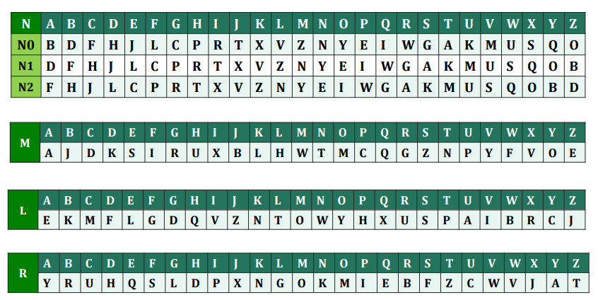

# 计算机网络安全概述

## 互联网是重要的社会基础设施

## 互联网中的攻击

### 蛮力破解

- 使用数字和字母的任意组合，猜出用户名和口令
- 花费大量时间，结果往往不理想
- 撞库攻击

### 中间人攻击

- 在两个受害者网络链路之间进行数据监听和数据篡改的攻击方式
- 数据监听和数据篡改

### 拒绝服务攻击

- 企图通过使计算机崩溃或把它压垮来组织提供服务
- 最为有效、存在最多
- SYN洪泛 (SYN flood) /UDP洪泛(UDP flood) /DNS反射攻击

### 病毒（恶意软件）

## 互联网中的防守

- 加解密技术
- 访问控制和身份认证
- 防火墙技术
- 防病毒技术
- 补丁技术

## Enigma

代换密码算法

按键使得滚轮N向前滚动一格，滚轮M和L皆保持不变

大约有一亿亿种可能性

# 密码学基础

## 初识密码

密码是一种用来混淆的技术，它希望将正常的、可识别的信息转变为无法识别的信息

## 密码学的基本概念

### 两种加密形式

1. 传统加密（对称加密、单钥加密）：代换密码、置换密码、二者组合
2. 现代加密（非对称加密、公钥加密）：把算法和密钥分开，密码算法公开，密钥保密

### 基本概念

- 明文：原始可以理解的信息或者数据
- 密文：加密后的信息
- 加密：从明文到密文的变换过程
- 解密：从密文到明文的变换过程
- 密码算法/密码：用来加密和解密的数学函数，$c=E(m), m=D(c) , D(E(m))= m$
- 密钥（key）：密码算法中的一个变量

### 密码学的基本模型

- 密码编码学
    1. 转换明文为密文的运算类型
        - 两个原理：置换和代换
        - 置换是将明文中的元素重新排列
        - 代换是将明文中的每个元素映射成另外一个元素
    2. 所用的密钥数
        - 发送方和接收方使用相同的密码：对称密码、传统加密
        - 发送方和接收方使用不同的密码：非对称密码、公钥密码
    3. 处理明文的方法
        - 分组密码/块密码：每次处理一个输入分组
        - 流密码/序列密码：连续处理输入元素
    
    无条件安全和计算安全
    
- 密码分析学

## 密码学的发展历程

- 古典密码：数据安全基于算法的保密
- 近代密码：加密体系的安全性并不依赖于加密的方法本身，而是依赖于所使用的密匙
- 现代密码：公钥密码使得发送端和接收端无密钥传输的保密通信成为可能

## 古典密码

### 代换技术

将明文字母替换成其他字母、数字或者符号的方法

- Casear密码：对字母表中的每个字母用它之后的第key个字母代换
- 单表代换密码：设一个密钥词放在前边，其余字母按顺序
- Playfair密码：基于由密钥词构成的5×5矩阵（I和J当作一个字母）

- Hill密码：将m个连续的明文字母代换成m个密文字母，这是由m个线性等式决定的
  
    加密过程：$C = KP(mod 26)$
    
    解密过程：$P = K^{-1}C(mod 26)$
    
- Vigenere密码:具体使用哪一行字母表进行编译是基于密钥进行的
- Verman密码和一次一密：一次一密是牢不可破的
  
    实际操作上存在很大困难：产生大规模随机密钥、密钥的分配和保护
    

### 置换技术

通过置换形成新的排列

### 破译举例

- 单表代换密码的破译：穷举法和频率分析法

## 对称密码算法

### 对称密钥简介

加密和解密使用相同的密钥：$K_E=K_D$

密钥必须使用秘密的信道分配

### 简化DES

### Feistel密码结构

乘积密码是指依次使用两个或以上的基本密码，所得密码强度将强于所有单个密码的强度

交替使用代换和置换（混淆和扩散）

扩散使明文的统计特征消散在密文中，混淆使密文和加密密钥的统计关系更复杂

每轮迭代都有相同的结构：

- 代换作用在数据左半部分，它通过轮函数F作用在数据的右半部分后，与左半部分进行异或来完成
- 每轮迭代的轮函数相同，但是输入的子密钥Ki不同
- 代换之后，交换数据的左右两半完成置换

影响Feistel具体实现的重要参数：

- 分组长度和密钥长度
- 迭代轮数
- 子密钥产生算法
- 轮函数

### DES算法

分组加密（分组长度64bits），对称密钥算法（密钥长度56bits，加上奇偶校验64bits），16次迭代

### 常用的对称密码

- 3DES：密钥长度112bits，两个密钥三重DES
- Blowfish：分组长度64bits，密钥长度32-448bits
- RC5：分组长度32、64、128bits，密钥长度0-2040bits
- AES：分组长度128bits，支持128、192、256bits密钥

## 非对称密码算法

### 算法原理

- 对称密钥密码系统的缺陷
    - 密钥必须经过安全的信道分配
    - 无法用于数字签名
    - 密钥管理复杂
- 公钥密码基于数学函数而不是代换和置换
- 公钥密码体制有6个组成部分
    - 明文：可读的信息
    - 加密算法：对明文进行的各种变换
    - 公钥/私钥：一个用于加密，一个用于解密
    - 密文：加密算法的输出，不可读信息
    - 解密算法：根据密文和相应的密钥，产生出明文
- 符号说明：会话密钥Ks，用户A的公钥KUa，用户A的私钥KRa
- 公钥密码体制
    - 公钥公开，用于加密和验证签名
    - 私钥保密，用作解密和签名
- 公钥密码系统的应用：加密/解密、数字签名、密钥交换

### RSA算法

- 密钥产生

- 加密/解密

- 对RSA算法的攻击方法：蛮力攻击、数学攻击、计时攻击

### DH密钥交换算法

### 其它公钥密码算法

- DSA：只能用于数字签名，基于计算离散对数的难度
- 椭圆曲线密码系统

## 密钥的分配

### 传统的对称密码分配

- 密钥由A选择，并亲自交给B
- 第三方选择密钥后亲自交给A和B
- 如果A和B以前或者最近使用过某个密钥，其中一方可用它加密一个新密钥后再发送给另外一方
- A和B与第三方C均有秘密渠道，则C可以将一密钥分别秘密发送给A和B

### 公钥的分配

- 公开发布：任一通信方可以将他的公钥发送给另外一个通讯方或者广播给通信各方
- 公开可访问目录：维护一个动态可访问的公钥目录可以获得更大程度的安全性；某个可信的实体或组织负责这个公开目录的维护和分配
- 公钥授权
- 公钥证书

### 利用公钥分配传统密码的密钥

- 简单的密钥分配方法
- 具有保密性和真实性的密钥分配方法
- 混合方法

# 消息认证技术

## 消息认证基本概念

### 网络环境中的攻击

- 泄密：将消息透露给没有合法密钥的接收方
- 传输分析：分析通信双方的通信模式
- 伪装：欺诈源向网络中插入一条消息

### 消息认证的概念

消息认证就是验证所收到的消息确实是来自真正的发送方且未被修改的消息

## 认证函数

产生认证符的函数称为认证函数

1. 消息加密：整个消息的密文作为认证符
    - 对称加密：解决对称加密中消息认证的方法是要求明文具有某种易于识别的结构，而且，不通过加密函数是不能重复这种结构的
    - 公钥加密：如果既要提供保密性，又要提供认证，发送方A可以先用其私钥加密(数字签名)，然后用B的公钥加密
2. 消息认证码MAC：MAC是消息和密钥的公开函数，它产生定长的值，该值作为认证符
    - 消息认证码：$MAC=C_k(M)$
        - M：输入消息
        - C：MAC函数
        - K：收发双方的共享密钥
        - MAC：消息认证码
        - MAC函数与加密类似，区别是MAC算法不要求可逆
    - MAC认证的过程
        - A和B共享密码K
        - A向B发送消息时，A计算MAC，将其附加在消息后面，一起发送给接收方
        - 接收方对收到的消息用相同的密钥K进行计算得到MAC，并与收到的MAC进行对比
    - 认证+保密
        - 与明文有关的认证：先将消息作为输入，计算MAC，附加在消息之后，然后对整个消息块加密
        - 与密文有关的认证：先将消息加密，然后将密文作为输入，计算MAC，并将MAC附加在上述密文之后形成待发送的信息块
    - 使用消息认证码MAC的情况
        - 将同一消息广播给很多接收者的情况
        - 在信息交换中，接收者希望可以随机地对消息进行认证
        - 对明文形式的计算机程序进行认证是很有意义的服务
        - 一些应用只关心消息的认证，而不关心消息的保密性
        - 将认证和保密性分开，可以使结构层次更灵活
3. Hash函数：它是将任意长的消息映射为定长的hash值的公开函数，以该hash值作为认证符
    - Hash函数
        - 单向的hash函数是消息认证码的一种变形
        - hash函数的输入是大小可变的消息M，输出是固定大小的hash码H(M)
        - 与MAC不同的是，hash码并不使用密钥，它仅仅作为输入消息的函数，hash码也称为信息摘要
        - Hash码是所有消息位的函数，它具有错误检测能力
    - 将hash码用于消息认证
        - 用对称密码对消息及附在其后的hash码进行加密
        - 用对称密码仅对hash加密：对不要求保密性的应用，这种方法会减少处理代价
        - 用公钥密码和发送方的私钥对hash码加密
        - 即希望保证保密性又希望有数字签名的，先用发送方的私钥对hash码进行加密，再用对称密码中的密钥对消息和上述加密结果进行加密
        - 假定通信双方共享公共的秘密值S，A将M和S联接后再计算hash值，并将其附加在M后面
        - 对整个消息和hash码加密：提供认证和保密性
    - 不使用加密函数：如果不要求保证保密性，就可以不使用加密函数，从而减少计算代价

## Hash算法

### 安全hash函数的一般结构

- Hash函数将输入消息分为L个固定长度的分组，每个分组长度为b位，最后一个分组不足b位时，需要填充成b位
- 输入中包含长度，增加了攻击的难度
- 设计安全hash函数可以归纳为设计具有抗碰撞能力的压缩函数问题，并且该压缩函数的输入是定长的

### 主要的Hash算法概述

- MD族：MD2、MD4、MD5
- SHA族：SHA-0、SHA-1、SHA-2、SHA-3
- 其它：HAVAL、Gost

### MD5

- 输入是任意长度的消息，对输入按照512位的分组为单位进行处理，算法的输出是128位的消息摘要
- 设计目标：
    - 安全性
    - 速度
    - 简单和简洁性
    - 倾向于使用低端结构
- 算法步骤：
    1. 增加填充位
        - 填充比特：第1位为1，其后各位皆为0
        - 填充比特后，使之与448模512同余
    2. 填充长度
        - 用64位表示填充前的报文长度，附加填充比特的后面
        - 以little-endian方式表示被填充前的消息长度
        - 完成填充后，消息的总长度是512的整数倍
    3. 初始化MD缓存
        - Hash函数的中间结果和最终结果都保存于128位的缓冲区中，缓冲区用4个32位的寄存器(A,B,C,D)表示
    4. 以512位的分组(16个字)为单位处理消息
        - 由四轮运算组成的压缩函数是算法的核心，
        压缩函数标记为HMD5
        - 使用一个随机矩阵$T[i] = 2^{32}|sin(i)|$
    5. 输出：所有的L个512位的分组处理完之后，第L个分组的输出即是128位的消息摘要
- MD5的强度

### SHA

- 算法步骤
    1. 增加填充位：填充消息使之与448模512同余
    2. 填充长度：用64位表示填充前的报文长度，附加在填充后的结果后面
    3. 初始化MD缓存：Hash函数的中间结果和最终结果都保存于160位的缓冲区中
    4. 以512位的分组(16个字)位单位处理消息
    5. 输出：所有的L个512位的分组处理完之后，第L个分组的输出即是160位的消息摘要

### RIPEMD-160

- 输入是任意长的消息，输出是160位的消息摘要；输入以512位的分组单位进行处理，hash值和链接变量是160位

### 各类算法比较

## 数字签名算法DSS

### 数字签名

- 直接数字签名
    - 直接数字签名只涉及通信双方
    - 发送方可以通过用自己的私钥对整个消息或者消息的hash码加密来产生数字签名
    - 再用接收方的公钥(公钥密码)和共享的密钥(对称密码)对整个消息和签名进行加密，则可以获得保密性
- 仲裁数字签名
    - 从发送方X到接收方Y的每条已签名的消息都先发给仲裁者A，A对消息及其签名进行检查以验证消息源及其内容，然后给消息加上日期，并发给Y，同时指明该消息已通过仲裁者的检验

### 数字签名标准DSS

DSS是一种公钥方法，与RSA不同，DSS不能用于加密或者密钥分配，只提供数字签名功能

- DSS使用hash函数，它产生的hash码和随机数k作为数字签名函数Sig的输入，签名函数依赖于发送方的私钥KRa和一组通信伙伴共同拥有的参数构成的全局公钥KUG
- 签名函数保证只有拥有私钥的发送方才能产生有效签名
- 签名由两部分构成：s和r
- 接收方对接收到的消息产生hash码，这个hash码和签名一起作为验证函数Ver的输入，验证函数依赖于全局公钥KUG和发送方公钥KUa；若验证函数的输出等于签名中的r，则签名有效

## （电子）身份认证简介

互联网世界中一切信息（包括各类对象的身份信息）都是用一组特定的数据来表示的，计算机只能识别用户的数字身份，因此身份认证的过程也是针对这组特定的数据进行的

### 构建安全网站的技术手段

- 正面
    - 认证
    - 授权
    - 审计
- 反面
    - 消灭各个层面的漏洞

## 网站身份认证技术

### 网站系统的基本构成

- 基本结构是采用开放式的客户/服务器结构（C/S）
- 完整的网站系统分为三个部分：
    - 服务器端：Web Server
    - 客户机端：浏览器Browser、专用程序
    - 通信协议：HTTP协议
- 网站系统中常用的技术：
    - HTML、JavaScript、多媒体技术
    - 服务端技术

### HTTP协议

- 超文本传输协议HTTP（Hyper Text Tansfer Protocol）是基于TCP/IP的应用层协议
- 主要特点：
    - 典型的C/S工作方式，简单快速，数据传输较少
    - 可以通过HTTP协议传输任意类型的数据对象
    - HTTP是面向一次连接的无状态网络协议

### 网站用户认证技术

- 最简单的网站用户认证：HTTP的Basic认证
    - 用户身份凭证：账号+静态口令
    - 在每次发出HTTP请求时，把用户身份凭证的明文发送到服务器端，服务器与存储在服务器端的用户凭证进行比较
    - 对账号口令（U,P）进行Base64编码(便于文本方式传输)，发送到Web服务器端
    - 服务器端接收后进行Base64解码得到（U,P），并与本地存储的账号口令（U,P）进行比较，认证用户身份
    - 优点：
        - 没有复杂的交互过程
        - 使用非常简单
    - 缺点：
        - 每次都需要传递账号和口令，易于被监听、盗取，安全性低
        - 本地（浏览器）还需要保存账号和口令，存在安全隐患
        - 服务器端处理每个HTTP请求都要进行一次身份验证过程，效率低
    - 改进：
        - 使用加密技术：账号口令加密，把口令作为密钥
        - 使用消息认证技术：客户端和服务器端共享密码K（口令）
        - 采用挑战/响应机制，需要进行两次HTTP请求：
            - 第一次请求：服务器向客户端返回一个挑战码M
            - 第二次请求：客户端使用MAC认证发送MAC码，服务器端进行验证
        - 使用表单验证+session的机制
- 改进解决Basic认证的问题：基于表单的身份认证
    - 一个Session包括特定的客户端、特定的服务器端以及特定的操作时间段
    - Session工作原理：
        - 当某个Session首次启用时，服务器会产生一个唯一的标识符发送到客户端，客户端收到后会存储下来
        - 在Session存活期间，客户端每次向服务器发送的HTTP请求都会包含上述唯一标识符，使得服务器能够把前后多次请求关联起来
    - 基于表单的Web身份认证过程通常包括三个步骤：
        1. 客户端向服务器发送请求，服务器返回包含表单的页面
        2. 用户按要求填写表单的内容完成后，客户端把表单内容发送到服务器；服务器获取表单中的内容后，进行验证，验证通过则启动Session并返回给客户端
        3. 客户端后续的请求包含Session的唯一标识符，服务端验证唯一标识符的合法性
    - 优点：简单、方便、易用
    - 缺点：安全性低，账号和口令明文在网络上传输，很大程度上存在被监听盗取的可能
    - 改进：
        - 引入Challenge/Response机制，避免口令明文通过网络传输，并且能避免重放攻击
        - 在第二步传输账号口令时，使用传输层SSL协议传输HTTP请求
    - 常见的不安全做法：
        - 验证成功后，把账号口令以Cookie机制存放在浏览器端
        - 验证成功后，把账号口令进行加密后以Cookie机制存放在浏览器客户端
    - 带来的问题：口令泄露，重放攻击
- 若干网站身份的增强认证技术
    - 手机短信口令
    - 动态口令
    - USB KEY
    - 数字证书

### 其它身份认证应用

- 操作系统登录身份认证
- 802.1X网络准入身份认证
- TUNet用户登录认证
- SSH协议登录验证

# 互联网安全协议

## 计算机网络安全体系结构

### 安全目标：CIA

- 保密性、机密性
- 完整性
- 可用性

### 安全服务

- 认证服务
    - 认证服务与保证通信的真实性有关
    - 两个特殊的认证服务：对等实体认证、数据源认证
- 保密服务
    - 保密服务是防止传输数据遭到被动攻击
    - 保密服务的另一方面是防止流量分析
- 数据完整性服务
    - 可对消息流、单条消息或消息的选定部分进行保护
- 访问控制服务
    - 限制实体的访问权限，通常是经过认证的合法实体才可以访问，标识与认证是访问控制的前提
- 抗抵赖服务
    - 防止发送方或者接收方否认传输或者接收过某条消息
- 可用性服务
    - 根据系统的性能说明，能够按照授权的系统实体的要求存取或使用系统或系统资源的性质

### 安全机制

- 安全机制分为两类：
    - 普通安全机制
        - 可信功能
        - 安全标签
        - 事件检测
        - 审计跟踪
        - 安全恢复
    - 特定安全机制
        - 加密机制
        - 数字签名机制
        - 访问控制机制
        - 数据完整性机制
        - 认证机制
        - 业务流填充机制
        - 路由控制机制
        - 公证机制
- 安全攻击分为两类：
    - 主动攻击：试图改变系统资源或者影响系统运行
    - 被动攻击：试图了解或者利用系统的信息但不影响系统资源

## 网络层安全协议

### IPsec：IP+安全

- 概述
    - IP级安全性：认证、保密、密钥管理
    - 现有IP协议的安全特性：
        - 无连接，不保证顺序到达，存在重复包、丢失包，设备简单、无状态
        - 所提供的安全服务：
            - 认证：无
            - 完整性：无
            - 保密：无
            - 访问控制：基于IP地址，但是不完备
        - 所面临的威胁：窃听、伪造IP地址、篡改、重发
    - IP协议是无状态、无连接的，IP数据报由20个字节的报头和来自传输层的数据构成
    - IPSec的原理在于可以在IP层加密和/或认证所有流量
    - IPSec的应用：虚拟专用网VPN
    - IPSec的实施：
        - 在主机上实现
            - 保障端到端的安全
            - 能够对用户的每个会话提供保障
            - 对应用透明，不必修改用户或服务器系统的软件
            - IPSec可以对最终用户透明
        - 在防火墙上实施
            - 无需改变操作系统
            - 为内部所有的应用提供安全服务
        - 在路由器上实施
            - 可以对通过公用网络在两个子网之间流动的数据提供安全保护
- 体系结构
    - IPSec文档：IPv6必须支持这些特性，IPv4可选
        - 体系结构
        - 认证头AH
        - 封装安全载荷ESP
        - 加密算法
        - 认证算法
        - 密钥管理
        - 解释域
    - IPSec服务
        - IPSec在IP层提供安全服务，系统可以选择所需要的安全协议，确定该服务所用的算法，并提供安全服务所需加密密钥
        - 使用AH协议报头的认证协议和为数据包设计的加密/认证协议ESP，提供安全性
            - ESP可以分为支持和不支持认证两种
            - AH和ESP均支持基于分布密钥的访问控制，而流量管理则与加密协议相关
        - 它们提供的安全服务包括：
            - 访问控制
            - 无连接完整性
            - 数据源发认证
            - 拒绝重放数据包
            - 保密性（加密）
            - 有限的信息流保密性
    - 安全关联SA
        - 安全关联SA是IPSec通信双方之间对某些要素的一种协商，一组安全信息参数的集合，包括：协议、操作模式、密码算法、认证算法、密钥、密钥生存期等
        - 关联是发送方和接收方之间的单向关系，该关联为双方的通信提供了安全服务
            - 如果需要双方安全交换，则建立两个安全关联
            - 安全服务可由AH或者ESP提供，但不能两者都提供
        - 一组安全关联SA由三个参数唯一确定：
            - 安全参数索引SPI
                - SPI是一个与SA相关的位串，仅在本地有意义
                - SPI由AH和ESP携带，使得接收方能够选择合适的SA处理接收包
            - IP目的地址IPDA
                - 只允许使用单一地址，表示SA的目的地址，可以是用户末端系统、防火墙或者路由器
            - 安全协议标识
                - 标识该关联是一个AH安全关联或ESP安全关联
        - 在任何IPSec的实现中，都有一个安全关联数据库SADB，它定义了与每个SA相关联的参数
        - SA的参数
            - 序数计数器：用于生成AH或ESP头中的序数值
            - 序号溢出标志：表明序列号计数器溢出是否应该产生审查事件并且阻止SA上额外包的传输的标志
            - 反重放窗口：用于决定输入AH或ESP报文是否是重播的32位计数器
            - AH信息
            - ESP信息
            - SA的生存期：一个时间间隔或字节计数；生存期结束时，SA必须终止，或用一个新的SA替换
            - IPSec协议模式：传输模式或者隧道模式
            - Path MTU：任何遵从的最大传送单位路径和迟滞变量
        - 由安全关联数据库SADB提供的功能必须在IPSec的任何实现中都存在，但提供功能的方式由实现者决定
        - 在IP包中，安全关联由IPv4或IPv6报头中的目的地址唯一标识，SPI被封装在AH或者ESP扩展头中
        - SA选择子
            - IP流量与特定SA相关是通过安全策略数据库SPDB的
            - 每个SPDB入口由一个IP集合和上层协议定义，称为选择子
            - 每个IP包的输出过程如下：
                - 在SPDB中比较相应域的值，寻找匹配的入口，可能是零或多个
                - 如果存在SA，则选定SA和其关联的SPI执行所需的IPSec处理（AH或ESP）
    - 传输模式、隧道模式
        - AH和ESP均支持两种模式：传输模式和隧道模式
        - 传输模式主要为上层协议提供保护，同时增加了IP包载荷的保护
            - 典型的传输模式用于两台主机之间进行的端到端通信
            - 传输模式的ESP加密和认证(可选)IP载荷，不包括报头
            - 传输模式的AH认证IP载荷和报头的选中部分
        
        
        
        - 隧道模式对整个IP包提供保护
            - 当IP包加上AH/ESP域后，整个数据包和安全域被当作一个新的IP载荷，并拥有一个新的外部IP报头
            - 新的IP数据包利用隧道在网络中传输，途中的路由器不能检查内部IP报头
            - ESP在隧道模式中加密和认证(可选)整个内部IP包，包括内部IP报头
            - AH在隧道模式中认证整个内部IP包和外部IP报头的选中部分
        
        
    
- 认证头AH
    - 认证头AH支持数据完整性和IP包的认证
    - 数据完整性确保包的传输过程中内容不可更改
    - 认证确保末端系统或者网络设备对用户或者应用程序进行认证，并提供相应的流量过滤功能，同时还能防止地址欺诈攻击和重放攻击
    - 认证基于消息认证码MAC，双方必须共享一个公钥
    - 认证头的组成：
      
        
        
        - Next header(邻接头)：标识数据载荷中的封装方式或协议
        - Payload length(有效载荷长度)：以 32 位字为单位的认证数据字段长度
        - Reserved(保留字)：保留以供将来使用，发送时必需设置为全零
        - Security Parameters Index(安全参数索引)
        - Sequence Number(序列号)：单调递增计数器，用于防范重放类型攻击
        - Authentication Data(认证数据AD)：变长域，包含完整性校验值ICV或者包的MAC
    - 反重放攻击
        - 重放攻击是指攻击者在得到一个经过认证的包后，又将其传送到目的站点的行为
        - 重复接收经过认证的IP包可能会以某种方式中断服务或者产生不可预料的后果，序列号域就可以防止重放攻击
        
        
        
    - 完整性校验值
        - 认证数据AD域包含完整性校验值ICV，ICV是一种报文认证编码MAC或者MAC算法生成的截断代码
    - 有两种途径使用IPSec认证服务
        - 直接在服务器和客户工作站之间提供认证
        - 在服务器不支持认证的情况下，远程工作站向防火墙证明自己身份，以便访问整个内部网络的时候，使用隧道模式SA
- 封装安全载荷ESP
    - 封装安全载荷ESP提供保密性服务包括报文内容保密和流量限制保密，ESP还可以提供和AH同样的认证服务
    - ESP格式
      
        
        
        - Security Parameters Index(安全索引参数)
        - Sequence Number(序列号)：单调递增的计数器，用于防范重放类型的攻击
        - Padding(填充域)：可变长域，范围在0~255字节
        - Pad Length：填充域长度
        - Next Header(邻接头)：标识数据载荷中的封装方式或协议
        - Authentication Data(认证数据AD)：变长域，包含完整性校验值ICV或者包的MAC
    - ESP的加密算法、认证算法、填充域
        - 可用加密算法有：3DES、RC5、IDEA、CAST、Blowfish
        - ESP支持使用默认为96位的MAC
        - 填充域的功能
            - 扩展明文长度
            - 保证ESP格式需要填充长度和邻接头域为右对齐的32位字
            - 隐藏载荷的实际长度，并提供部分流量保护
- 安全关联组合
    - 单个SA可以实现AH或者ESP，但是不能两者都实现
    - 安全关联组合是指提供特定的IPSec服务集所需的一个SA序列，SA可通过两种方式组合成束
      
        
        
        - 传输邻接：在不使用隧道的情况下，对一个IP包使用多个安全协议；组合AH和ESP的方法仅允许一级组合
        - 隧道迭代：指通过IP隧道应用多层安全协议；由于每个隧道可以在路径上的不同IPSec节点起始和结束，因此该方法允许多层嵌套

### IKE：为IPsec管理密钥

- IKE概述
    - IPSec体系结构支持两种密钥管理类型：手工的、自动的
    - IKE协议为IPSec提供了自动协商交换密钥、建立了安全关联SA的服务，简化了IPSec的使用和管理
    - IKE协议解决了在不安全的网络环境中安全地建立或更新共享密钥的问题
    - 其核心技术是DH密钥交换算法，具备了完善的前向安全性
    - IKE为IPSec提供了如下功能：
        - 降低手工配置复杂度
        - 安全关联SA定时更新
        - 密钥定时更新
        - 允许IPSec提供反重放服务
        - 允许在端与端之间动态认证
    - IKE = ISAKMP格式 + Oakley模式 + SKEME密钥交换
- IKE的报文格式
    - 继承自ISAKMP，也称为ISAKMP报文
    - 可以在任何传输层协议或IP层上实现，利用UDP协议的端口500进行传输
    - 双方交换的信息以“报文头+载荷”的形式传输，每个报文由一个定长的报文头和不定数量的载荷组成
    
    
    
    - ISAKMP定义了13种载荷，具有相同格式的载荷头
- IKE的体系结构
    - IKE使用了两个阶段的ISAKMP框架
        - 第一阶段：协商IKE SA
            - 建立一个经过验证的安全通道，为后续的协商提供机密性和完整性保护
            - 可以使用主模式和积极模式，这两种模式只能在第一阶段中使用
                - 主模式提供了对通信双方的身份保护
                - 当身份保护不必要时，可以使用积极模式以减少信息传输的数量，提高协商效率
            - 主模式：6个信息交互
                - SA交换：在协商之前，发起者和响应者必须计算产生cookie，用于唯一的标识每个单独的协商交换过程
                - 密钥交换：发起方和响应方采用Diffie-Hellman密钥交换算法计算共享密钥
                - 身份交换和认证：如果双方在消息⑤和消息⑥中的散列载荷中的hash值相同，那么双方的认证成功
            
            
            
            - 积极模式：3个信息交互
                - 适用于一方地址为动态的情况
                - 快速模式传输的消息更少，效率更高
                
                
            
        - 第二阶段：协商IPSec SA
            - 一个IKE SA协商（第一阶段）可为多个IPsec SA协商（第二阶段）提供服务
            - 第二阶段为IPsec AH和/或IPsec ESP协商安全参数，还可以实现密钥数据的交换
            - 第二阶段中使用快速模式进行信息交换，一个第二阶段协商可以建立多个安全关联
            - 需要协商的参数
                - 加密算法
                - 哈希算法
                - 验证方法
                - DH组
                - 存活周期类型及长度
                - 密钥长度
            - 快速模式：3个消息交互
- IKE的工作模式
    - 端节点到端节点：采用传输模式
        - 两个端节点均实现IPsec，通常使用传输模式
        - IP头与数据间插入IPsec头，用来保护数据载荷
    - 安全网关到安全网关：采用隧道模式
        - 端系统均不需要实现IPsec，由网络节点完成保护功能
        - 通常采用隧道模式发送，内部IP头包含实际端节点的IP地址
    - 常见的上面两种模式的嵌套组合
- IKE的工作过程
    - IKE在协议实现上，是以守护进程的方式在后台运行
    - 可以通过两种方式来启动IKE服务，由内核提交创建IKE SA请求，或同级IKE守护进程提交协商SA请求
    - 两个守护进程通过UDP来传递消息
    - IKE协议使用两个数据库：SADB和SPDB
    - SPDB在每个条目中隐藏有指针：无论对于外出IP包还是进入IP包，首先都要对SPDB表进行查询，以决定是否丢弃、绕过或应用IPsec
    - IKE守护进程接收到内核发来的请求后，查询SPDB，得到所有协商参数；然后向远程IKE进程发出协商请求；IKE进程开始协商
    - 如果协商成功，把新协商的SA增加到SADB中
    - 当管理员指示IKE守护进程不再使用某个SA时， IKE守护进程会从SADB中删除掉相应的记录SA，同时会向远地的IKE守护进程发送删除信息，表示本地已经不再使用此SA了
    - 远地IKE进程收到此信息后，根据实际的要求作不同的处理
- IKE协议总结
    - 主要用途局限于为IPsec通信双方建立安全关联SA
    - 标准定义的复杂性容易导致理解上的困难和实现上的混乱，最终会导致不同实现间的互操作困难
    - 完成协商的消息往返次数过多，这样会消耗较多的计算以及网络带宽资源
    - 容易受到各种攻击，由于设计缺陷，协议实现容易受到拒绝服务攻击、中间人攻击、重放攻击等多种攻击行为的威胁

## 传输层安全协议

### SSL：为应用层服务

- SSL概述
    - SSL工作在TCP协议上，目前不支持UDP
    - SSL与应用层协议无关，可以支持HTTP、Telnet、FTP等面向连接的应用层协议
    - SSL为端到端的应用提供保密性、完整性、身份认证等安全服务，具有良好的互操作性、可扩展性和相对高的效率
    - 采用SSL协议，可确保信息在传输过程中不被修改，目前在互联网中广泛用于处理财务等敏感信息
- SSL体系结构
    - 会话
        - SSL会话是客户端和服务器之间的一个关联，即一个虚拟的连接关系
        - 通过握手协议建立，用以协商密码算法、主密钥等信息，一个会话协商的信息可以由多个连接共享
    - 连接
        - 连接是一个特定的通信信道，通常映射成一个TCP连接
        - 连接一般是短暂的
    - SSL协议由以下协议组成：
        - SSL记录协议
        - SSL握手协议
        - SSL警告协议
        - SSL修改密码规约协议
- SSL记录协议
    - 为SSL连接提供两种服务
        - 保密性：使用SSL握手协议定义的共享密钥，用传统密钥算法对SSL载荷进行加密
        - 报文完整性：用握手协议定义的共享密钥计算报文认证码
    - 操作过程：
        - 分段：每个上层报文被分成$<2^{14}$字节的数据块或更小
        - 压缩：压缩不能丢失信息，并且对于短的数据块，压缩后增加内容不能超过1024字节
        - 增加MAC：使用共享密钥在压缩数据基础上计算MAC
        - 加密：使用对称加密算法对压缩报文加上MAC进行加密
        - 增加首部：内容类型、主要版本、次要版本、压缩长度
- SSL握手协议
    - SSL的部分复杂性来自于握手协议，握手协议在传递应用数据之前使用
    - SSL握手协议允许客户端和服务器端相互认证、协商加密和MAC算法，保护数据使用密钥通过SSL记录传送
    - 主要功能包括：
        - 协商密码算法
        - 协商主会话密钥
        - Client和Server之间的相互认证
    - 报文格式：类型、长度、内容
    - 四个阶段：
        1. 建立安全能力
            - 客户向服务器发送client_hello报文
            - 服务器向客户端发送sever_hello报文
        2. 服务器认证和密钥交换
            - 服务器发送其SSL数字证书
            - 服务器发送sever_hello_done报文，等待客户端响应
        3. 客户认证和密钥交换
            - 收到服务器发来的sever_hello_done以后，客户端验证server提供的证书是否有效
            - 客户端发送client_key_exchange，此消息包含pre_master_secret和消息认证码密钥，在后续阶段，pre_master_secret 用来计算master_secret
            - 如果客户端发送了Certificate给服务器，客户端将发出签有客户端专用密钥的certificate_verify，通过验证此消息的签名，服务器可以显示验证客户端数字证书的所有权
            - 主密钥master_secret并不直接用于数据加密和认证，而是用来产生连接所需要的一系列密钥
        4. 结束
            - 客户端使用一系列加密运算将pre_master_secret转化为master secret ，派生出用于加密和消息认证的所有密钥
            - 客户端发出change_cipher_spec，服务器转换为新协商的密码对
            - 客户发送在新算法、密钥的finished，验证密钥交换和认证过程是否成功
            - 服务器发送change_cipher_spec，将挂起状态迁移到当前的cipher_spec，并发送结束报文
            - 握手完成，客户和服务器可以交换应用层数据
- SSL告警协议
    - 告警协议用于向对等实体传递SSL相关的警报,和使用
    SSL的其它应用一样，告警消息按照当前状态压缩和加密
    - 此协议的每个消息由两个字节组成
- SSL修改密码规约协议
    - 功能
        - 在握手协议的结束阶段发送，通知接收方，以后的记录将使用刚才协商的密码算法和密钥进行加密/认证
        - 接收方把会话的挂起状态复制到当前状态，使以后的连接使用这些密码参数
    - 报文结构：只有一种报文，只有一个字节，只有一个值(1)是有效的
- SSL安全性分析
    - 几乎所有操作平台上的WEB浏览器以及流行的Web服务器都支持SSL协议，因此使用SLL协议开发成本小
    - 但是 SSL协议的数据安全性其实就是建立在RSA等算
    法的安全性上，从本质上来讲，攻破RSA等算法就等同于攻破此协议
    - 一个安全协议除了基于其所采用的加密算法安全性以外，更为关键的是其逻辑严密性、完整性、正确性，SSL比较好地解决了这一问题
    - SSL协议可以很好地防范 “重放攻击”

## 应用层安全协议

### HTTPS：HTTP+SSL

- WEB及其安全威胁
    - WWW三项基础技术
        - 用于编写文档的超文本标记语言HTML（支持超文本链接）
        - 用于发布资源的超文本传输协议HTTP
        - 通过互联网引用其它可访问文档或资源的统一资源定位URL
    - WWW技术实际上是运行在互联网和TCP/IP上的一个客户/服务器程序
    - WEB的安全特点
        - 互联网是双向的
        - Web服务器容易受到互联网的攻击
        - Web越来越多地成为商业合作和产品信息的发布窗口和商务交易的平台，如果Web服务器被攻击，就可能金钱失窃或信息受损
        - Web的使用比较简洁，但底层支持软件却很复杂，容易产生安全漏洞
    - WEB安全的目标
        - 确保Web服务器存储数据的安全
        - 确保Web客户端的计算机是安全的
        - 确保服务器和浏览器之间的信息传输的安全
    - Web的安全威胁
        - 按照威胁分类
            - 主动攻击
            - 被动攻击
        - 按照威胁位置分类
            - Web服务器安全
                - 用户认证
                - 访问控制
                - 日志
            - Web客户端安全
                - 对服务器的认证
                - 访问控制机制和签名
            - 服务器和客户端之间的通信安全
                - IPsec
                - SSL/TLS
                - MIME/PGP/SET
    - Web流量安全方法
        - IP级安全
        - TCP级安全
        - 应用级安全
- 针对HTTP的攻击举例
    - HTTP的缺陷
        - 明文传输，没有数据完整性校验
        - 无状态连接，无法验证双方身份的真实性
    - 常见的针对HTTP的攻击
        - 监听嗅探：由于HTTP采用明文信息传输，可以被直接嗅探到明文
        - 篡改劫持：攻击者可以修改通信数据包，达到篡改信息和劫持回话的目的
        - 伪造服务器：由于HTTP协议并不验证服务器的可信度，故而存在ARP欺骗、DNS欺骗以及钓鱼等风险
        - 中间人攻击：攻击者与通讯双方分别建立独立的联系，并交换其所收到的数据
    - 地址解析协议ARP
        - 工作在数据链路层，实现MAC地址和IP地址的映射
        - ARP协议通过建立和维护IP-MAC映射表进行工作
    - ARP欺骗
        - ARP欺骗是一种中间人攻击的常用手段
        - 攻击者可以通过制造伪造的ARP frame，修改网内任何计算机的映射表，从而切断目标主机的互联网通讯，窃取目标主机关键信息
    - DNS欺骗
        - ARP欺骗成功后，可以继续进行DNS欺骗
- HTTPS = HTTP + SSL
    - HTTPS是HTTP和SSL/TSL协议的合并，解决了数据加密、完整性校验、对服务器的身份认证等问题
    - SSL在TCP之上建立了一个加密渠道，通过这一层的数据经过了加密，因此达到保密的效果
- SSL能否确保HTTPS安全
    - SSLStrip：针对HTTPS的攻击

### SET：安全电子交易

- 电子商务安全 需求分析和体系结构
    - 网络支付面临的安全问题
    - 网络支付的安全需求
    - 电子商务安全体系
        - 电子商务对安全的基本要求
            - 授权合法性
            - 信息的保密性
            - 信息的完整性
            - 身份的真实性
            - 不可抵赖性
            - 存储信息的安全性
        - 网络系统安全：针对物理技术系统的安全问题
            - 保证网络设施的正常运行
            - 避免受到外界的恶意攻击
        - 网络信息安全：针对商务逻辑系统的安全问题
            - 信息保密、信息完整
            - 身份认证、不可抵赖
            - 信息有效
        - 网络交易安全
            - 参与对象之间交易过程的安全，如安全嵌套层协议(SSL)、安全电子交易协议(SET)、公钥基础设施(PKI)
- 安全电子交易协议SET
    - SET协议简介
        - 保证交易的私密性、保密性、完整性、抗抵赖
        - 目标
            - 真实性
            - 保密性
            - 隐私
            - 实时性
        - 关键特征
            - 信息的机密性
            - 数据的完整性
            - 卡用户账号的认证
            - 商家的认证
    - SET协议参与方
        - 持卡人
        - 收款行
        - 商家
        - 支付网关
        - 发卡方
        - 证书权威
    - SET协议交易过程
    - SET协议支付处理过程
        1. 购买请求
            - 四个报文组成：发起请求、发起响应、购买请求和购买响应
            - Payment Information和Order Information：
                - PI和OI必须分开加密和签名，以保证用户的隐私不被泄露
                - PI和OI必须有联系，以防止商家篡改信息，产生纠纷
            - 双签名
                - 双签名的目的是为了连接两个发送给不同接收者的报文
                
                
                
            - 客户生成购买请求
            
            
            
            - 商家验证用户的订单
            
            
            
        2. 支付授权
            - 商家需要通过支付网关、发卡行得到授权，才能给用户发货
            - 支付授权交换由两个报文组成：授权请求和授权响应
            - 支付网关对支付授权请求的处理
                - 验证所有证书的合法性
                - 解密数字信封，获得会话密钥，解密authorization block
                - 验证商家对authorization block的数字签名，解密支付信息
                - 验证双签名
                - 验证transaction ID与PI中的是否一致
                - 从发卡行申请支付
        3. 支付获取
            - 商家只有通过支付获取才能完成银行的转账业务
            - 支付获取由获取请求和获取响应报文组成
            - 获取请求报文由以下几部分组成：支付的数量、交易ID、获取权标、商人的签名密钥、证书
            - 获取响应报文由以下几部分组成：网关的签名、加密获取相应数据块、网关签名密钥证书

### S/MIME：安全电子邮件

- 电子邮件系统安全需求
    - 电子邮件系统安全问题
        - 匿名转发
        - 电子邮件欺骗
        - 垃圾邮件和邮件炸弹
        - 邮件病毒
    - 如何解决上述安全问题
        - 端到端的安全电子邮件技术，保证邮件从被发出到被接收的整个过程中，内容保密、无法修改、并且不可否认
        - 在传输过程中也保密，借助传输层安全技术
            - 利用SSL SMTP和SSL POP
            - 利用VPN，将所有的TCP/IP传输封装起来，也包括邮件
        - 邮件服务器本身必须安全可靠，目前对邮件服务器的攻击主要分为：
            - 防范网络入侵主要依赖于软件编程时的严谨程度
            - 对于拒绝服务攻击的防范，主要包括：
                - 防止来自外部网络的攻击
                - 防止来自内部网络的攻击
                - 防止中继攻击
    - 安全需求包括：机密性、完整性、可认证、抗否认
- 电子邮件系统工作原理
    - 电子邮件系统的构成
    
    
    
    - 电子邮件主要相关协议
        - SMTP
            - 没有提供任何安全服务
            - 可以拒绝超过一定大小的邮件信息
            - 在ASCII码与EBCDIC码之间转换时没有使用统一的映射
        - POP3
            - 请求/响应协议
            - 其命令由短关键字构成，后边接着可选的参数，以CR和LF符结束，作为单行文本发送
        - IMAP4
            - 是一种强有力的邮箱访问方式，它为用户提供了有选择地从邮件服务器接收邮件的功能、基于服务器的信息处理功能和共享信箱功能
        - RFC822
            - 定义了一种用于电子邮件传输的文本消息格式，是基于互联网传递的文本邮件消息标准
            - 消息包括信封和内容两个部分
            - 一个消息包括若干行的报头和无限制的正文
            - 不能支持非ASCII码字符集信息
            - 不能处理中文、日文、包含格式的文本信息和多媒体信息
        - MIME
            - 对RFC822框架的一个扩展，以兼容的方式解决现有电子邮件传输协议存在的一些问题和限制
            - 包含了如下要素：
                - 定义了五个新的报头域
                - 定义了若干内容转换，从而标准化地支持多媒体的电子邮件
                - 定义了编码转换方式，使得任何内容格式均可转化为邮件系统认可的格式
- 安全的电子邮件协议
    - PEM
        - 主要功能包括加密、源认证和完整性
        - 报文加密采用DES算法，报文认证采用MD5算法
        - 由于PEM依赖于一个即存的、完全可操作的PKI，而建立PKI需要很长的过程，大大限制了PEM的发展，现在几乎没有人使用
    - MOSS
        - 改变了PEM只支持文本信息的局限性，支持了MIME，将PEM和MIME两者的特性进行了结合
        - 但是MOSS有很多的执行选项，这可能导致两个不同的开发人员提出的两种MOSS邮件无法沟通
        - MOSS往往被认为是一种框架而不是一个规范，在实现时还要考虑许多实际问题，因此也没有被业界广泛使用
    - S/MIME
        - 目前常用的端到端安全电子邮件标准：PGP和S/MIME
            - S/MIME侧重于作为商业和团体使用的工业标准
            - PGP则倾向于为用户提供个人电子邮件的安全
        - S/MIME是在PEM的基础上建立起来的，使用RSA，与MIME一起来保护电子邮件信息
        - S/MIME已经成为产业界广泛认可的协议
    - PGP
        - 既是一个特定的安全电子邮件应用，也是一个安全的电子邮件标准
        - 符合PEM的绝大多数规范，但不要求PKI的存在
        - 创造性地把RSA公钥体系的方便和传统加密体系的高度结合起来，并在数字签名和密钥认证管理机制上有非常巧妙的设计
        - 功能强大，速度快，源代码公开
- S/MIME
    - 概述
        - 从PEM和MIME发展而来的，提供统一的方法来接收和发送MIME数据，提供的安全服务包括认证、数据机密性、消息完整性和非否认
        - 目标是实现安全的电子邮件，侧重于作为商业
        和团体使用的工业标准
    - 功能
        - 提供了签名和加密消息的能力
        - 封装数据：由任何类型的加密内容和加密该内容所用的加密密钥组成，密钥可以是一个或者多个接收方对应的多个密钥
        - 数字签名：
            - 通过提取待签名内容的数字摘要，用签名者的私钥加密；然后，用base64编码方法重新对内容和签名编码
            - 轻载的透明签名：只有数字签名采用base64编码方法，没有S/MIME能力的接收方虽然无法验证签名，却可以看到消息内容
    - 密码算法
        - 组合三种公钥算法
            - DSS是其推荐的数字签名算法
            - Diffie-Hellman是其推荐的密钥交换算法
            - 3DES是其推荐的消息加密算法
    - 加密过程
    - 解密过程
    - 数字签名过程
    - 消息处理过程
        - 使用了一系列新的MIME内容类型，所有新类型都使用PKCS指示
        - 保护MIME实体
        - 封装数据
        - 签名数据
        - 透明签名

# 入侵检测技术

## 用户入侵

### 入侵者

- 入侵者通常指黑客和解密高手，一般分为：
    - 假冒者
    - 非法者
    - 秘密用户
- 假冒者一般是外部使用者，非法者一般是内部人员，密码用户内外部用户均有可能
- 入侵者的攻击可能是友善的，也可能是险恶的

### 入侵技术

- 入侵者的动机是获取系统访问权或者扩大在系统中的权限范围
- 入侵者需要获得系统保护信息，这些信息一般以用户口令的形式存在
- 常用的获取口令技术有：
    - 使用系统提供的标准账户和默认口令
    - 穷尽所有的短口令
    - 尝试系统在线词典中的单词或类口令单词列表
    - 收集用户的信息
    - 尝试用户的电话号码、房间号码、身份证号码等
    - 尝试本国所有合法的牌照号码
    - 使用特洛伊木马逃避访问控制
    - 窃听远程用户和主机系统之间的线路
- 口令文件可以采用如下方式进行保护：
    - 单向加密
    - 访问控制
- 对于入侵者防范的主要措施有：检测和阻止
    - 检测注重掌握攻击成功前后所采用的思路
    - 阻止在于挫败所有可能的攻击

### 入侵检测

- 入侵检测建立的前提是假设入侵者的行为在某些情况下不同于合法用户的行为
- 入侵者的攻击和合法用户正常使用资源的区别不可能十分明显，甚至含有很多相似之处

### 审计记录

- 入侵检测的基本工具是审计记录
- 审计记录有两种方法：
    - 原始审计记录
    - 检测专用的审计记录
- 每个审计记录可以包含如下几个域：
    - 主体：行为的发起者
    - 动作：主体对一个对象的操作或者联合一个对象完整的操作
    - 客体：行为的接收者
    - 异常条件：若返回有异常，则标识出该异常情况
    - 资源使用：大量元素的列表，每个元素都给出某些资源使用的数量
    - 时间戳：动作发生时用来标识时间的记录

### 入侵检测方法

- 常用的入侵检测方法包括：
    - 基于统计的方法
        - 收集一段时间内合法用户的行为，用统计测试来观测其行为，判定该行为是否是合法用户行为
            - 阈值检测
                - 与一段时间间隔内的特殊时间发生的次数有关，如果发生次数超过了期望的合理次数，则认为可能存在入侵
            - 基于轮廓的检测
                - 归纳出每个用户过去的行为特征或者用户组过去行为的特征，用于发现有重大偏差的行为
        - 统计方法能够有效地对付假冒者，因为假冒者不可能模仿他们盗用帐号的行为模式，但统计方法不能防范合法者
    - 基于规则的方法
        - 基于规则的入侵检测系统是通过观察系统中的事件，运用规则集判定一个给定的活动模式是否可疑
        - 基于规则的渗透鉴别建立在专家系统之上，关键在于使用规则去鉴别已知的渗透或利用已知弱点的渗透
        - 基于规则的入侵检测分成两种类型：
            - 异常检测：定义规则，用于检测现在的行为和以前使用的模式的差别
            - 渗透鉴别：用专家系统来查找可以的行为
        - 基于规则的异常检测使用基于规则的方法分析审计记录，确定使用模式，并自动产生描述此模式的规则

### 蜜罐技术

- 入侵检测技术中相对较新的创新是蜜罐，蜜罐是诱导潜
在攻击者远离重要系统的一个圈套
- 蜜罐的功能是：
    - 转移攻击重要系统的攻击者
    - 收集攻击者活动的信息
    - 希望攻击者在系统中逗留足够的时间，使管理员能对此攻击做出响应
- 蜜罐系统使用的工具包括灵敏的监视器和事件日志
- 任何对蜜罐的攻击，系统都会给出攻击成功的假相。所以系统管理员可以在不暴露真正在工作的系统条件下，有时间转移、记录、跟踪攻击者
- 蜜罐系统充满合法用户无法访问、但表面看起来有价值的虚假信息，因此任何对蜜罐的访问都是可疑的

## 软件入侵

### 恶意软件

- 软件入侵就是一些恶意软件，利用计算机系统的弱点进行攻击的恶意程序
- 这些恶意程序可以分成两类：依赖于宿主程序的和独立于宿主程序的威胁
- 病毒、蠕虫和木马

### 陷门

- 陷门是一个程序的秘密入口，通过它程序员可以不按照通常的访问步骤获得访问权，进行程序调试和测试
- 从功能上，陷门可以分为三个级别：
    - 系统级：在系统层能访问数据和进程
    - 应用级：逃逸安全机制的合法程序
    - 密码级：能够以某种方式看懂密文
- 从控制方法上，陷门的分类
    - 本地权限的提升
    - 单个命令的远程执行
    - 远程命令行解释器访问
    - 远程控制GUI
- 后门的安装与案例
    - 自己植入
    - 软件漏洞
    - 社会工程

### 逻辑炸弹

- 逻辑炸弹是最早出现的恶意软件之一，它预先规定了病毒和蠕虫的发作时间。逻辑炸弹是嵌在合法程序中的、只有当待定的事件出现时才会进行破坏的一组程序代码

### 特洛伊木马

- 特洛伊木马程序是一种实际上或者表面上看起来有某种有用功能的程序，它内部含有隐蔽代码，当被调用时会产生一些意想不到的后果
- 特洛伊木马使潜伏者执行非授权的功能
- 木马系统软件一般由木马配置程序、控制端程序和木马程序(服务器程序)等三部分组成
- 木马软件的常用手段
    - 名字欺骗
    - 文件捆绑
    - 软件下载
    - Html传播

### Zombie

- Zombie秘密地接管其它依附在Internet上的计算机，并使该计算机发动攻击，而且这种攻击很难通过追踪Zombie的创建者查出来
- Zombie被用在对拒绝服务的攻击上，尤其是对Web站点的攻击。它被放置在成百上千的、属于第三方的计算机中，通过向Internet发送不可抵抗的攻击取得对目标Web站点的控制

### 病毒

- 病毒是一种可以通过修改自身来感染其它程序的程序，这种修改包括对病毒程序的复制，复制后生成的新病毒同样具有感染其他程序的功能
- 通过寄居在宿主程序上，计算机病毒可以暂时控制该计算机的操作系统盘
- 没有感染的软件一旦在带毒计算机上运行，就会在新程序中产生病毒拷贝，病毒就会通过软盘或者网络传播开来
- 病毒的生命周期
    - 潜伏阶段
    - 传染阶段
    - 触发阶段
    - 发作阶段
- 病毒的种类
    - 寄生性病毒
    - 引导扇区病毒
    - 常驻存储器病毒
    - 隐蔽性病毒
    - 多态性病毒

### 蠕虫

- 什么是蠕虫
    - 一种能够自我复制的计算机程序，它利用网络上计算机系统的漏洞自主的将自己复制到其它计算机上
        - 一个独立的计算机程序，不需要宿主
        - 自我复制，自主传播
        - 占用系统或网络资源、破坏其它程序
        - 不伪装成其它程序，靠自主传播
    - 蠕虫的危害
        - 蠕虫的传播造成网络拥塞
        - 对计算机系统和信息安全造成波坏
        - 蠕虫的破坏力巨大
    - 网络蠕虫病毒利用以下网络工具进行传播
        - 电子邮件设备
        - 远程执行功能
        - 远程登录功能
- Morris Worm
    - 主要攻击方法
        - rsh，rexec：用户的缺省模式
        - sendmail的debug模式
        - finger的缓冲区溢出
        - 口令猜测